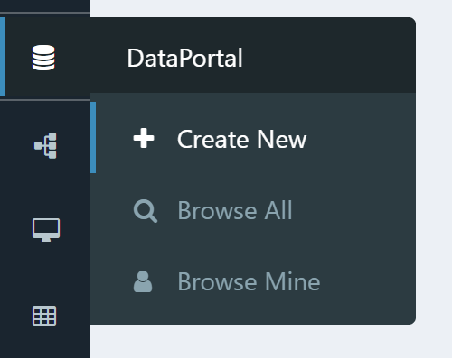

# Creating a DataPortal

Create a new DataPortal by choosing the icon in the side navigation bar.

You will be presented with an overview page. We urge you to read through the description shown, and also download the sample Excel template files that are available (on the right hand side of the screen).

## DataPortal Configuration

Begin with one of the Excel templates provided.

### Excel Sheet Basics

Each sheet in the Excel workbook represents a container or table. Column headings in a sheet define the control setting, with rows representing values. The following column headers are typically found on each of the Excel sheets:

- [Name:](06.Setting-Details/Name.md) A whitespace-free name for the field. Think of this as the name you would give this field in a database.
- [DisplayName:](06.Setting-Details/DisplayName.md) A human-friendly label that will be displayed above the input box for the field on the user interface.
- [Description:](06.Setting-Details/Description.md) A longer description that can be displayed in a tooltip on the user interface to more fully explain the field.
- [Type:](06.Setting-Details/Type.md) The name of the data type of the given field, such as integer or string.
- [ControlType:](06.Setting-Details/ControlType.md) The type of form control that will be shown to the user to input their data for this field.
- [Required:](06.Setting-Details/Required.md) Indicates whether the field is required.

!!! note
    Note the special case for ‘Label’ fields — DisplayName contains rich text written in [Markdown.](https://daringfireball.net/projects/markdown/)

#### Sheet Types

Your Excel template can include many sheets, of a few different types:

- **Master**: This is the first sheet that is processed by Composable and acts as a link to all other container sheets that will ultimately be shown to the end user. This is a required sheet in the workbook. The [Name](06.Setting-Details/Name.md) given as a value here will serve as the root database name.

- **“Container”**:  These can be any name that is not reserved and specify what input fields are listed out in each web page the user sees, as well as any controlling logic of how they are saved and displayed.  Think of these sheets as tables in your data model, with each input field name representing a column in a SQL table.

- **“Category"**:  These specify a single picklist for the end user, such as Gender or State you live in.  They can be in its own sheet or in the Categories sheet. See [here](04.Categories.md) for additional details.

- **Categories**: On this sheet, each column represents its own category to simplify the Excel structure if you have a lot of categories in your data model. See [here](04.Categories.md) for additional details.

- **ReadMe**: This sheet is not processed or displayed to the end user of forms, it is a place to store notes and comments on the model.

- **CSS**:  An optional sheet for the user to enter custom CSS rules to style the forms page with any colors, margins or other custom style behavior.

#### Control Definitions

Three columns are required for every row of every Container sheet, [Name,](06.Setting-Details/Name.md) [Type,](06.Setting-Details/Type.md) and [ControlType](06.Setting-Details/ControlType.md). These three settings will do most of the work in generating your DataPortal, but there are many additional settings that can be applied to some fields by adding columns. Which settings are available varies by [ControlType](06.Setting-Details/ControlType.md). For full details, visit the page for each control type:

- [AppRun:](05.Control-Details/AppRun.md) Specifies a button that runs a Composable [DataFlow](../03.DataFlows/01.Overview.md) by ID.
- [Category:](05.Control-Details/Category.md) Select one or more predefined values. Also see [Categories.](04.Categories.md)
- [CheckBox:](05.Control-Details/CheckBox.md) Checkbox for Boolean types.
- [Computed:](05.Control-Details/Computed.md) Read-only field computed from other values.
- [Date:](05.Control-Details/Date.md) Select a date
- [DateTime:](05.Control-Details/DateTime.md) Select a date and time
- [HyperLink:](05.Control-Details/HyperLink.md) Link to another page within Composable or on another site.
- [Label:](05.Control-Details/Label.md) Additional static text. Supports Markdown formatting.
- [Link:](05.Control-Details/Link.md) Special control type representing the entry point to the DataPortal.
- [NumberFormatting:](05.Control-Details/NumberFormatting.md) Editable number field with customizable formatted display when not editing.
- [Page:](05.Control-Details/Page.md) Link to a new container in a 1-1 relationship with the current container.
- [Phone:](05.Control-Details/Phone.md) Enter a phone number.
- [QueryView:](05.Control-Details/QueryView.md) Display the results of a Composable [QueryView](04.QueryViews/Overview.md).
- [QueryViewChooser:](05.Control-Details/QueryViewChooser.md) Select a row from a Composable [QueryView](04.QueryViews/Overview.md) and use its values to populate other fields.
- [Radio:](05.Control-Details/Radio.md) Select one of several predefined values. Also see [Categories.](04.Categories.md)
- [Rating:](05.Control-Details/Rating.md) Give a whole number rating within a customizable range.
- [Reference:](05.Control-Details/Reference.md) Chose an instance of another container within the same DataPortal
- [Spin:](05.Control-Details/Spin.md) Select a numerical value.
- [SSN:](05.Control-Details/SSN.md) Enter a Social Security Number.
- [Tab:](05.Control-Details/Tab.md) Split some fields of a container into a visually distinct tab.
- [Table:](05.Control-Details/Table.md) Display a table of instances of a child container.
- [Text:](05.Control-Details/Text.md) Enter a short string.
- [Textarea:](05.Control-Details/Textarea.md) Enter a long string.
- [Voice *(experimental)*:](05.Control-Details/Voice.md) Enter a long string by automatic transcription of spoken words.
- [YesNo:](05.Control-Details/YesNo.md) Set a boolean field with buttons.
- [ZIP:](05.Control-Details/ZIP.md) Enter a 5 digit ZIP code

## DataPortal Build

To build the DataPortal, simply save the Excel template, and drag and drop it into Composable. Done.