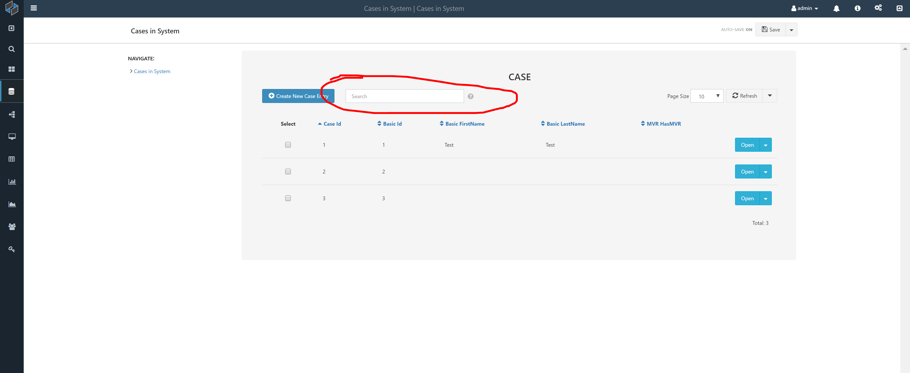

# Search Feature

The search box in Composable DataPortals supports many different powerful features for searching tables in Composable DataPortals.

## Including search boxes for each column field in a table

When specifying the table in your DataPortals, if you add a control type SearchBoxes with value True (case insensitive), a search box will appear above each column in your table that will only search that column. For columns that are categories, a drop-down menu with available choices will appear.

## Search values have built-in type checking

All data stored in the forms database that the user inputs is stored as types.  Some example field types are: a Name field will be stored as a string type, an Age field as an integer, a SmokingInd checkbox field as a Boolean, and a BirthDate field as a date.

When a user enters a search term it will be automatically coerced into each field type the term is being searched against.   Currently supported types:

**NULL** - represents a field where no vaue has been saved into
**Number** - represents  an integer or decimal number
**Date** - a date in the format MM-DD-YYYY
**Datetime** - a date time specified with datetime([User Date]) such as dateTime(Friday, February 27, 2009 12:11 PM) that specifies a date time and possible offset.
**Boolean** - represents true, false values to check the state of check boxes
**String** - default type if none of the above can coerced. If you want to include special characters or terms such as AND or OR, you must wrap you text in double-quotes, "dogs and cats"
**Categories** - are saved as string types. To match to a category, the entire search term must exactly match the category property selected.

## Simple User Search

A user entered search query is taken as a single string to be searched across all visible columns for a possible match. An example might be the user string 55. This will only match to a number column that is 55, not 4554 or 55.04. For string columns, it would match a subset of the string, such as 555 Berkshire Lane. For a category column, it would only match the value 55 in the category, not 555.

Boolean Operators such as 'and', 'or', are supported between search terms and are case insensitive.  If the search term was 55 Berkshire, no implicit and's are included so only string fields with 55 Berkshire as a substring would be matched. If you want 55 or Berkshire, you can search for 55 or Berkshire to return rows that contain either search term.  If you wish to search for the strings 'and', 'or', spaces or a special character wrap your search term in double quotes, such as " * and #".

## Entity User Search (Advanced Search)

An entity user search is where more of the advanced search functionality in DataPortals shines. With entity search user can search for any field that exists as a child of the table being searched, not just those visible in the table. In addition, a user can specify comparison constraints on individual fields such as numeric comparisons, sub-string searches or comparing fields across child components.  The general search structure of an entity search term is composed of comparison expressions joined by Boolean operators.  The search term can include parenthesis to establish precedence between comparisons.

### Comparison Expression:

A comparison expression consists of comparing a fixed value against a field in the table instances, or comparing fields inside each table instance.  The general structure of a comparison expression is (Value Comparison Value), where only table instances that return true for this comparison are shown to the user.

### Comparison Operators:

Comparison operators such as = or != (not equals) are supported across all types. <,>,<=,>= work on numeric types while 'like' is supported for string field comparisons.

### Fixed Value:

Fixed values are any of the types specified above such as: string, number, date, dateTime, null or boolean. String values have to be surrounded with double-quotes while numeric or Boolean fields are parsed automatically.

### Form Value:

Form values are fields on the table instance that are being searched on, such as Name. Form values are case sensitive, so Name and name represent different fields. Also, the name searched upon is not the display name shown to the user, but the field name that is stored in the database, which will never include spaces. To search for table instance form fields, reference the interested field with dot notation, such as containerone.containertwo.fieldname. When searching table instance fields, all possible table fields are checked and if any comparisons return true, the instance is returned in the table. For example, if you have a sub-table in your table entry of family members, a search query of familymembers.name = "George" will return all instances where at least one family member is names George.

### Numeric Operators:

When forming a comparison expression with numeric values, performing simple numeric operations such as '+,=,*,/' are supported. A query such as NumFamilyMembers > NumChildren + 2 could be performed. Parenthesis can be used as well, with spaces between terms and the parenthesis.