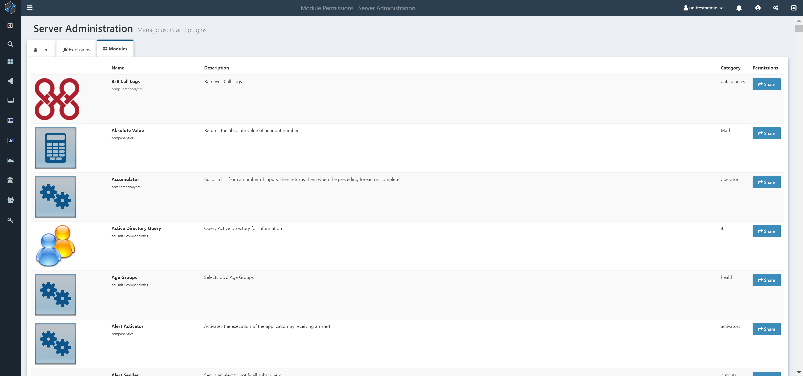

# Resource Management

Composable provides system level features to help users manage their resources within the platform. Key functions for system administrators are also available.

## [Users](../Users-and-Groups/01.Overview.md)

Users in Composable are a 'securable resource' created for an end-user. Users can be created by the end-user through the registration form or by a System Administrator through the Administration portal). A user consists of a name, email address and security credentials.

Users can access their profile by clicking on the icon in the topbar.

On a user profile page, users can:

- Edit their user details (e.g., Name, Organization)
- Upload a profile photo
- View a list of all their Composable resources (e.g., DataFlows, QueryViews, WebApps, ...)
- View a list of Groups they are members of
- View their recent activity
- Reset their password
- Generate an API token

!!! note
    The API Token can be used to authenticate when communicating with Composable web resources.

- Link their profiles

!!! note
    Users can link their profiles from other third-parties (e.g., Slack, Salesforce, Fitbit, Twitter, ...) and integrate with these services via DataFlows.

## [Groups](../Users-and-Groups/01.Overview.md)

Groups in Composable are collections of users. Any user can create a group, and add members accordingly. Users can be added to the group by the owner, and also by any user or any other group, with write access to the group. Users can also request to join a group. Group owners are sent an email when a join request is created, and owners have the option to accept or reject it.

Groups provide a natural and collaborative mechanism for multiple users to work together on specific tasks. Groups can be given permission to specific Composable resources (e.g., DataFlows). Rather than giving permissions at the individual user level, permissions can be specified at the group level. For example, if you want to give only certain people write permissions to a DataFlow, you can create a group, assign the group write permissions to that DataFlow, and then add users to the group. 

## Folders

Folders in Composable provides a method to logically group Composable resources (e.g., DataFlows, QueryViews, WebApps, ...). Folders can then be shared with users and groups.

## [Keys](../Keys/01.Overview.md)

Composable Keys are 'environment variables' that can remain persistent, re-used, and shared, across other Composable resources (e.g., DataFlows), users and groups. Keys are most often used to define and configure connection settings (e.g., to databases) just once, and allow these connections settings to be used across all resources.

## Permissions and Security

There are several security infrastructure mechanisms used in Composable. At a transport level, all web traffic is encrypted and sent over SSL (Secure-Socket-Layer). Web server and activation processes run as limited privilege accounts. Processes accessing data use accounts with the minimum rights necessary for retrieving and saving the data.

Composable users are given a considerable amount of flexibility when using modules and designing DataFlows. For example, users can issue web requests to remote web services, run queries on external databases, run custom code modules, and automatically send emails. Composable employs several features to not only protect the system from malicious users, but also to protect users from one another.

### Sharing of Resources

Users currently have the ability to specify granular permissions on all Composable resources that they own (e.g., provide other users and groups the ability to execute, write, read, delete, ...).

By default, any resource created by a user can only be seen by that user. A user can assign either another user or group particular permissions to a resource. For a DataFlow, the permissions are:

- Clone
- Delete
- Discover
- Execute
- Read
- Read-Metrics
- Read-Private

To set permissions on a given resource, find the `Share` button (typically on the top right corner of the screen).

After clicking `Share`, a modal will pop up, allowing users to:

1. Search for specific users and groups (autocomplete enabled)
2. Add the selected entity
3. Grant/Revoke permissions
4. Save changes

!!! note
    Groups are similiarly a securable resource in Composable, and permissions on them can be set. Note the circular dependency between groups and permissions. This allows users to create interesting permission functionality like allowing individuals within a group to see who else is in the group. This functionality can be achieved by giving the group read access to itself.

## System Administration

System Administrators in Composable will see a gears icon in the right-hand side of the topbar allowing them to navigate to an Administration portal.

The Administration portal consists of three tabs for management of users, extensions and modules.

### User Management

The user tab of the Administration portal provides an interface to list and search all users. Administrators can select a specific user and perform a number of functions, including:

- Lock / Unlock a user
- Grant / Revoke administrator rights
- Change / Reset password

### Extension Management

The extensions tab of the Administration portal provides an interface to list and search across all extensions or plugins that is installed on the Composable instance.

### Modules Management

The modules tab of the Administration portal provides an interface to list and search across all modules (used within DataFlow applications). Administrators can select a specific module and set its permissions, giving individual users or groups the ability to discover and use the modules. 

!!! note
    Users are not granted permissions to certain modules (e.g., File Mover) by default. If a user requires a module, but cannot find it in the Module Library, it is most likely due to the modules permission settings, that can be configured by the system administrators using this portal.
