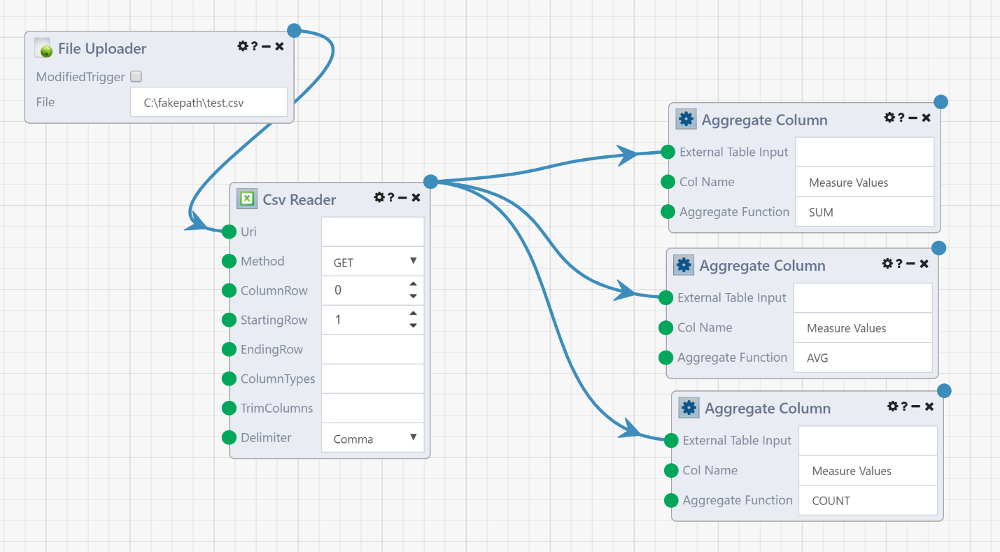
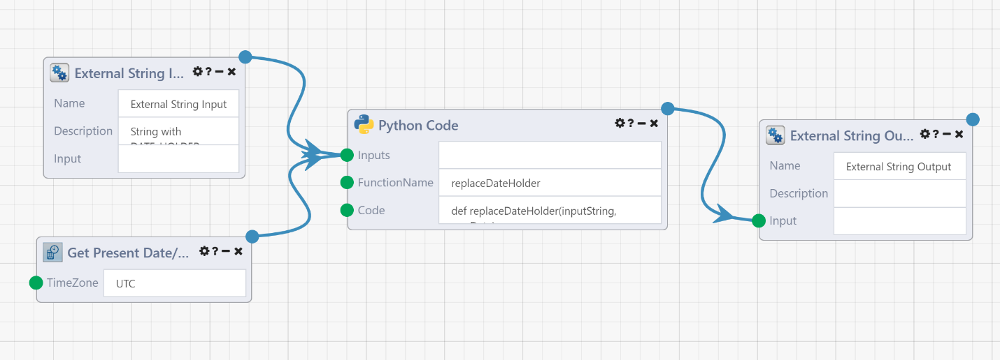

# Code Reuse and Modularity in Composable

Composable provides special mechanisms for managing complexity of DataFlows. DataFlows can be encapsulated as stand-alone custom Modules - sometimes referred to as "Nested DataFlows" or "App Reference Modules".

When developing your DataFlow applications in Composable, users have access to hundreds of “first-class” Modules that are available immediately. Users may take a subset of these Modules, expose the inputs and outputs, and save it which makes it useable as a custom Module. For those familiar with traditional text-based programming languages, this is essentially the Composable equivalent of functions, and allows for code reuse.

Code reuse is the use of existing code across multiple applications. Software engineers employ systematic software reuse as a strategy for increasing productivity and improving quality. This is captured in the general programming philosophy of Don’t Repeat Yourself (DRY) that states “Every piece of knowledge must have a single, unambiguous, authoritative representation within a system.” This strategy holds true for flow-based programming, as well as traditional text-based programming, and is a key feature when authoring complex DataFlows in Composable.

## Creation

All saved DataFlows can be used as App Reference Modules in other DataFlows. After saving a DataFlow, it can be accessed as an App Reference Modules from the Module Library, similar to other "first-class" Modules, in the "My DataFlows" or "Search All DataFlows" category of the Module palette.

!!! note
    To expose inputs and outputs on DataFlows that are being reused as App Reference Modules, utilize the External Input and Output Modules, as described below. The inputs and outputs of the App Reference Modules will reflect the External Input and Output Modules in the DataFlow.

A subsection of a DataFlow can also be turned into an App Reference Modules automatically. Select some of the Modules in the DataFlow, right click and select `Create DataFlow from selection`. This will automatically save the selected Modules as a new DataFlow, and replace them with a App Reference Module.

!!! note
    When using the `Create DataFlow from selection` function, Composable automatically externalizes the inputs\outputs! There is no need to place External Input and Output Modules first.

## Example

As an example of code reuse, let us assume that we need to perform an identical task many times, either within a single DataFlow or by multiple distinct DataFlows. For this example, the repeated task takes in a specific column of a table, performs an aggregation (e.g., SUM, AVG, or COUNT), and outputs the result. We can compose a DataFlow for this task, utilizing first-class Modules wrapped with External Input and External Output Modules, and save it as its own DataFlow.

!!! Note
    The External Input and Output Modules work to expose the inputs and outputs of a DataFlow within a parent DataFlow. Use the correct External Input and Output Modules based on the data type required (e.g., string, integer, boolean, table, etc.).

Here is what this DataFlow will look like with the External Input and Output Modules:

What we have are three inputs (the data table, the column name to be aggregated and the aggregate function) and one output (the resulting aggregate value). The inputs and outputs are exposed by use of the External Inputs and External Outputs Modules, which will become Module connections within the parent DataFlow where this is used. Note that the value in the description box will become helper text for these connections, so be sure to make good use of these!

With the inputs and outputs exposed, our resulting DataFlow can now be encapsulated into a single custom Module. 

Now, a parent DataFlow may use this "App Reference Module" just like any other Module. For example, we can reuse the above DataFlow three times as follows:

Here, we upload a single CSV file, and flow the resulting data table into three instances of our custom App Reference Module to perform a SUM, AVG and COUNT on a specific column.

## Custom Modules

While code (DataFlow) reuse is an excellent way to organize and condense complex workflows, you can use these concepts of reuse and modularity in conjunction with the Code Module to generate your own custom Modules. This can be helpful when no combination of existing first-class Modules can achieve a required function.

As an example, assume that a repetitive data engineering task requires you to replace all occurrences of a given substring (in this case DATE_HOLDER) with a new string (the current date). This can be achieved as follows:

Note that here, we used the Python Code Module, but you may use any number of languages (from Python to R to SAS). The code Module allows you to insert your own algorithm (in any number of languages).

The above DataFlow is encapsulated as a single custom App Reference Module.

And, with Composable being a collaborative platform, you may share this custom App Reference Module with other users within your organization.

## Summary

For more complex workflows, you can logically group a set of Modules and encapsulate them into their own child DataFlow (referred to as an App Reference Module), and have a parent DataFlow application reference and call the child DataFlow. The App Reference Module looks and feels like any other Module, but its functionality is to call the referenced DataFlow. To provide inputs into the DataFlow, and retrieve certain outputs, the referenced DataFlow must have certain Module inputs and outputs marked as externalized with additional data (name and description). The DataFlow author does this by adding the External Input\Output Modules that externalize inputs and outputs. These external Modules then become the inputs and outputs in the App Reference Module in the calling DataFlow application.

In conjunction with a code Module, for languages ranging from R to Python to SAS, custom Modules can be developed rapidly, reused across multiple DataFlows, and shared with other users.
