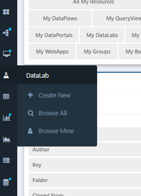
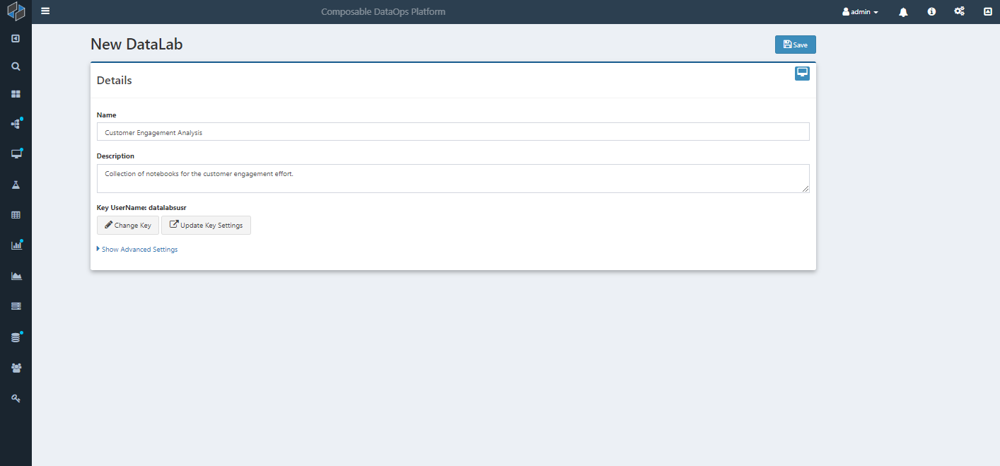
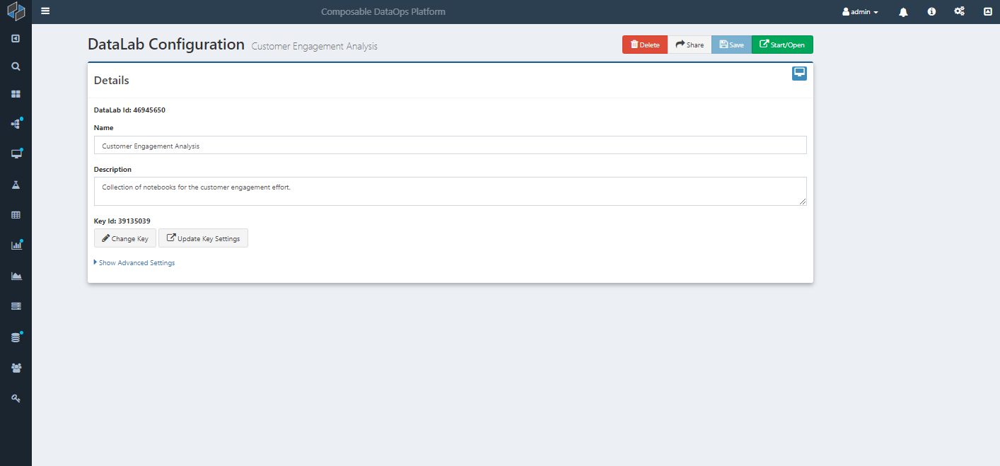

# DataLabs

Composable Datalabs provides a self-service, interactive programming notebook solution for exploratory, code-centric work using Python, Julia and other languages.

Data engineers, data scientists and machine learning engineers typically use notebooks for interactive programming and development. Notebooks provide a framework that combines (markdown-based) text and executable code in a single, web-based, editable document ("notebook").

The limitations inherent with Notebooks are that they are typically run locally, which means:

- users need to install their own copy of Python/Julia/etc. locally, and set up ,configure and manage their own development environment
- notebooks that are run locally are inherently limited to the hardware and performance of the local machine/laptop
- notebooks are not shareable with other users, and moreover, there are constant issues from inconsisent dev environments across environments

Composable Datalabs are server-hosted notebooks that overcome these limitations and further provide enterprise-scale features for collaboration and security. Specifically, Composable DataLabs has the following features and advantages:

- Interactive Programming, Unlimited Scale, and Zero Management

Composable DataLabs are hosted and executed on the server infrastructure, and can therefore leverage the scale of the cloud. Local development environment no longer need to be configured and maintained by individual users. Simply log into Composable, create a new DataLab and start coding.

- Collaboration and Security

Composable DataLabs are always available, from any machine with a web browser and access to the Composable instance. With enterprise-grade, granular permission settings, DataLabs can be shared with other [Composable Users and Groups](../Users-and-Groups/01.Overview.md). DataLabs are executed on the server infrastructure, it will be using the same environment, with all the correct libraries, packages and modules already installed.

## Creating a DataLabs

To create a new DataLabs, select the icon in the side navigation menu.

You'll be presented with an overview page for your new DataLabs. Simply fill in the name and description. You will also need to select a [Composable Key](../Keys/01.Overview.md) of a user/service account with access to the underlying compute machine.

Once you select a [Composable Key](../Keys/01.Overview.md), an option is shown to either change the Key or view the Key.

You can then click on Save, and your DataLab will be saved and you will be brought to the configuration page, where you can Start or Open the newly created DataLab. The configuration page also provides buttons and additional settings, for Sharing, Deleting and performing other functions.

## Composable Integrations

Composable DataLabs integrates with other Composable resources, such as [Composable DataFlows](../DataFlows/01.Overview.md). Specifically, DataLabs comes pre-installed with [composapy](https://github.com/ComposableAnalytics/ComposaPy/), a python package that integrates and binds with the core Composable stack.

## Other Integrations

Other python libraries can be installed from within a notebook by simply utilzing the `pip install` command. For example: `pip install numpy`
