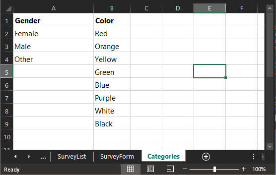

# Categories

Category sheets define the list of values a user can choose in a single/multi select field. After being defined in a container sheet, a separate "Category" sheet lists the category values. There are a few options for control types to display a category selection:

- [Category](../05.Control-Details/Category.md)
- [Pill](../05.Control-Details/Pill.md)
- [Radio](../05.Control-Details/Radio.md) (single value selection only)

### Visibility Controls

There are a few ways to control whether category values are visible to the user from logic based on other selections/inputs in the current DataPortal container.

- [MaskedCondition](./06.Setting-Details/MaskedCondition.md): controls visibility of the entire input field
- [VisibilityCondition](./06.Setting-Details/VisibilityCondition.md): controls visibility of the entire input field
- [CategoryCondition](./06.Setting-Details/CategoryCondition.md): This setting column in your container allows logic to control the visibility of the entire category, and allows filtering for specific category values.
- [Option Controller](./06.Setting-Details/OptionController.md) and AvailableWith: This controls the visibility on the category value level and requires a single category sheet. See below.

## Single Category Sheet

A single category sheet lets the user list out the values for a category as well as provide additional options not available in the `Categories` sheet. When referencing this category from another sheet, define the Type as `Form.<CategorySheetName>`.

- **Id (required)**: An integer key that will be used to reference the category value in your database table 
- **Value (required)**: The category value
- **Description**: A description
- **AvailableWith**: Used with the [Option Controller](./06.Setting-Details/OptionController.md). The OptionController column in your container references another field in the container. Then the AvailableWith column in the single category sheet defines which category values are visible based on what OptionController field value is selected. `|` is used as 'or' to allow the value to be available with more than one OptionController input.

As an example for using the AvailableWith column, in the above image, value `Z` will always be visible as a selection value. `X` and `Y` will only be shown if `A` is the value in the OptionController field.

## Multiple Category Sheet

Instead of a separate sheet for each categort, multiple categories can be descibed in a sheet named `Categories`. In this sheet, each column represents its own category to simplify the Excel structure if you have a lot of categories in your data model. The `Id` defined in a single category sheet is assigned automatically. The header is the category name, and the body rows are the category selections. When referencing this category from another sheet, define the Type as `Form.<CategoryName>`.

