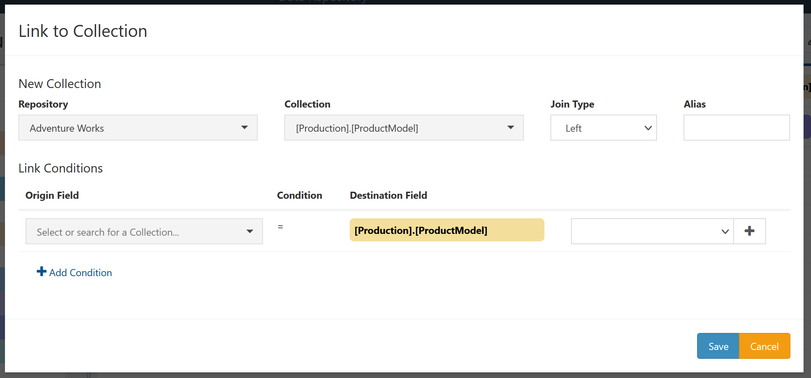
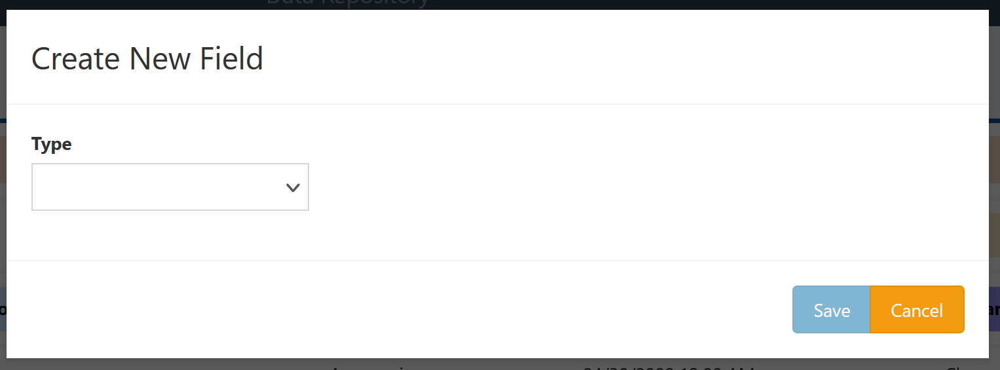
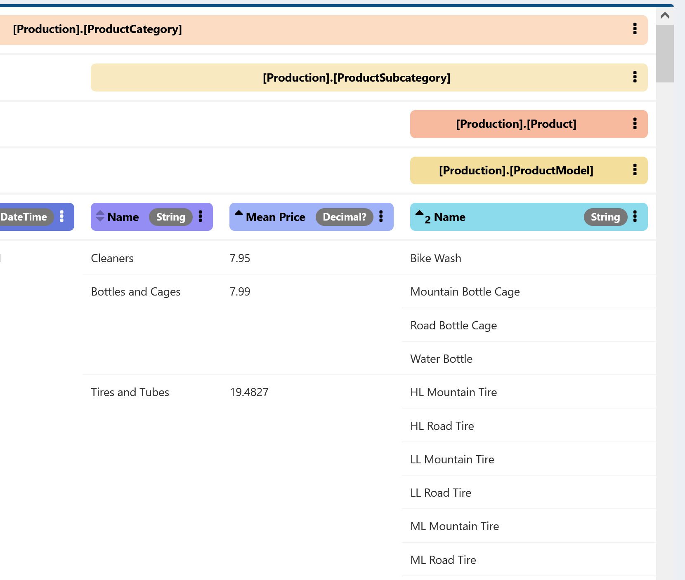
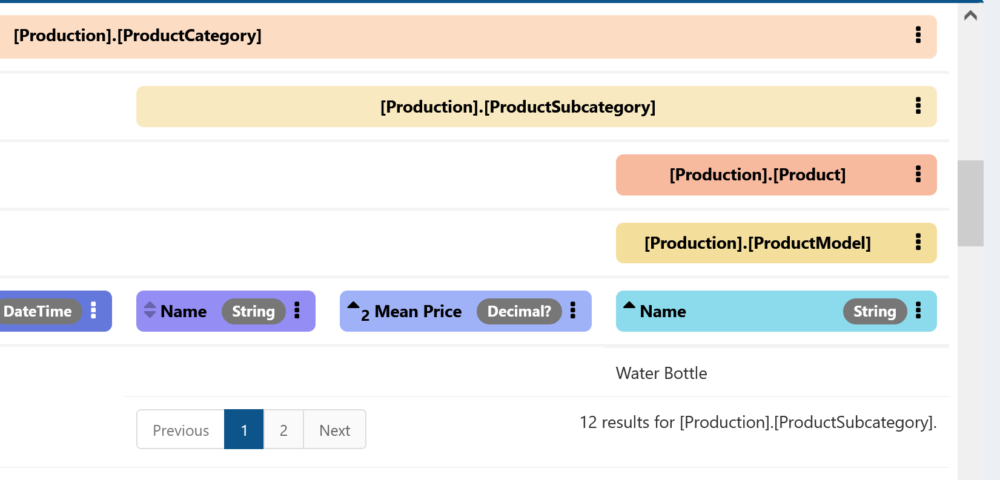

# DataQuery Details

This page contains detailed information about core DataQuery concepts and the options available for them.

## Collections

Every DataQuery contains one or more collections. Each query collection points to a particular [Repository Collection](./Repository-Details.md#collections), but multiple query collections may point to the same Repository Collection, allowing complex queries that join multiple parts of the same underlying data together.

The first collection in the query is the **Root Collection**. All other collections are defined relative to the root collection, and top level paging of results is based on rows of the root collection.

All other collections in the query are **Nested Collections**. A nested collection is joined to one or more other collections in the query via Link Conditions, defining how to line up rows of the nested collection with the rest of the query. In the hierarchy of collections illustrated by the expanded header row, nested collections appear beneath all collections involved in their link conditions.

### Adding Collections

To add a new collection to an existing query, click the `Collection` button from the `Add` section at the bottom of the `Query` sidebar. This will open a new window to define the link to the new collection.

The first step of linking a new collection is to select the underlying **Repository** and **Collection** to join to. Select or search for a Repository first and then a collection within that repository.

Next choose the **Join Type** to use for the new collection. This determines the behavior of the query when no data is available for a particular row of the joined collection:

- **Left**: Rows missing from the new collection will not impact other collections
- **Inner**: Only rows with matches in the new collection will be included in the parent collection(s)

Optionally provide an **Alias** for the new query collection. If no alias is provided the name of the underlying collection will be used, so an alias is particularly helpful when including the same collection multiple times.

Once an underlying collection has been selected, the **Link Conditions** can be configured.

At least one link condition must be provided. For each link condition, the **Origin Field** is a field on a query collection already included in the query and the **Destination Field** is a field on the new collection to be added. For both origin and destination it is also possible to create a new field from this screen by clicking the + button (after selecting a collection in the case of the origin field). See [below](#creating-fields) for details on creating new fields.

Click Save to create the new collection and add it to the query. No fields will be added automatically, but the new collection will become available in the sidebar list of `Included Collections`.

### Collection Menu Options

To interact with a collection, click the three-dot icon on the right side of the collection label in the results header or the sidebar. The options in this menu are as follows:

|Action                                         |Description                                            |Notes  |
|-----------                                    |------------------------------------                   |-------|
|[Add](./Collection-Menu-Options/Add.md)        |Insert the collection into the query                   |Available only for suggested collections|
|[Remove](./Collection-Menu-Options/Remove.md)  |Remove the collection and all its fields from the query|Not available for root collection|
|[Edit](./Collection-Menu-Options/Edit.md)      |View and modify the definition of this collection      |Not available for root collection|
|[Link](./Collection-Menu-Options/Link.md)      |Add a new collection linked to a field of this collection||
|[Add Field](./Collection-Menu-Options/Add-Field.md)|Create a new field using a field from this collection as the source||
|[Default Paging](./Collection-Menu-Options/Default-Paging.md)|View and modify paging behavior for this collection          |Not available for root collection|
|[Rename](./Collection-Menu-Options/Rename.md)  |Rename this collection||

## Fields

Fields define the data to return from the query. Each field belongs to a particular query collection; in most cases this association is automatically determined by the structure of the query.

Three types of fields are currently supported:

- [**Simple Fields**](./Field-Types/Simple.md) are read directly from an underlying data source.
- [**Aggregate Fields**](./Field-Types/Aggregate.md) are computed from a set of rows of another field.
- [**Constant Fields**](./Field-Types/Constant.md) have a constant value in every row.

### Creating Fields

To create a new field, click the `Field` button from the `Add` section at the bottom of the `Query` sidebar. This will open a new window to define the new field.

Select which type of field to create. Creation details vary by type.
    
- [**Aggregate Fields**](./Field-Types/Aggregate.md#creation)
- [**Constant Fields**](./Field-Types/Constant.md#creation)

[**Simple Fields**](./Field-Types/Simple.md) cannot be created this way because they are autogenerated when a collection is added. To add a new simple field to a query, find it in the `Available Fields` list for the appropriate included collection, open the menu, and select [Add](./Field-Menu-Options/Add.md).

### Field Menu Options

To interact with a field, click the three-dot icon on the right side of the field label in the results header or the sidebar. The options in this menu are as follows:

|Action                                            |Description                                            |Notes  |
|-----------                                       |------------------------------------                   |-------|
|[Add](./Field-Menu-Options/Add.md)                |Insert the field into the query                   ||
|[Show](./Field-Menu-Options/Show.md)              |Show the field in the query results  |Available only for hidden fields|
|[Remove](./Field-Menu-Options/Remove.md)          |Remove the field from the query      |Unavailable for fields required by some other part of the query|
|[Hide](./Field-Menu-Options/Hide.md)              |Hide the field from the query results             ||
|[Edit](./Field-Menu-Options/Edit.md)              |View and modify the field definition              |Unavailable for [simple fields](./Field-Types/Simple.md)|
|[Rename](./Field-Menu-Options/Rename.md)          |Rename the field                  ||
|[Add Filter](./Field-Menu-Options/Add-Filter.md)  |Add a [filter](#filtering) using this field       ||
|[Edit Filter](./Field-Menu-Options/Edit-Filter.md)|View and modify [filters](#filtering) using this field |Available only for fields with at least one filter|
|[Aggregate](./Field-Menu-Options/Aggregate.md)    |Create an [aggregate field](./Field-Types/Aggregate.md) using this field as the source||
|[Group By](./Field-Menu-Options/Group-By.md)      |[Group](#grouping) the query by this field        ||
|[Ungroup](./Field-Menu-Options/Ungroup.md)        |Do not [group](#grouping) the query by this field |Available only for fields currently being grouped by|
|[Link](./Field-Menu-Options/Link.md)              |Add a new collection using this field in a link condition   ||

### Status indicators

Field labels also include several icons that indicate the current status of that field within the query.

|Name|Image|Description|Click Action|
|----|-----|-----------|------------|
|Sort Control||Shows if and how field is being used to sort query results|Cycle through sorting options; see [below](#ordering)|
|Hidden||Indicates field is hidden from query results|Equivalent to [Show](./Field-Menu-Options/Show.md) |
|Filter||Indicates a filter exists using this field|Equivalent to [Edit Filter](./Field-Menu-Options/Edit-Filter.md)|
|Group||Indicates query is being grouped by this field|Equivalent to [Ungroup](./Field-Menu-Options/Ungroup.md)|

## Query Modifiers

Beyond selecting collections and fields to include, query results can be modified in several ways.

### Ordering

By default, the order of results returned from the query is not guaranteed to follow any pattern. The order can be set by selecting one or more fields to order by.

#### Sort States

The sort control icon can appear in a variety of states, representing different conditions for the field with respect to the order of query results:

|Icon|Name|Description|
|----|----|-----------|
||Unsorted|Field is not being used to sort (but can be)|
||Ascending Primary|Query is being sorted by this field from low to high|
||Descending Primary|Query is being sorted by this field from high to low|
||Ascending Secondary|Query is being sorted by another field and this field is being used as a secondary sort, from high to low| 
||Descending Secondary|Query is being sorted by another field and this field is being used as a secondary sort, from low to high| 

The number modifying secondary sorts indicates the given field's position in the set of fields being used to order.

Note that some fields will have no sort control at all. This either indicates that the field is not yet included in the query (e.g. it is a simple field for a newly added collection) or that the data in the field is of a type that cannot be used for sorting (e.g. `xml` data in a `SQL Server` database).

#### Selecting Fields

To order by a field, click the sort control icon on the left hand side of the field label. Clicking will toggle through primary sort states in this order:

1. Unsorted
1. Ascending Primary
1. Descending Primary

Thus clicking on a descending primary field will return that field to the unsorted state.

To create secondary ordering, click on a sort control while holding down the `Shift` or `Ctrl` key. Either of these modifiers will add the selected field to an existing set of order fields rather than replacing the existing sort. Holding down `Shift` will add the new field to the end of the order, while holding down `Ctrl` will add the new field to the start.

#### Nested Order

Due to the nesting structure of query collections, sorting by some fields may have no impact on results in some collections. The general rule is that sorting by a given field will determine the order of results for that field's collection and any direct ancestors of that collection.

For example, in this query, `[Production].[ProductSubcategory]` and `[Production].[ProductCategory]` are sorted by `Mean Price` and `[Production].[ProductModel]` is sorted by `Name` within each row of `[Production].[ProductModel]`. If the secondary sort were not applied to `Name`, the sorting of `[Production].[ProductModel]` would be arbitrary.

Compare that that sort to the following, in which `Name` on `[Production].[ProductModel]` is the primary sort and `Mean Price` is the secondary.

The sort on `Name` can be applied to all collections in this query, so the first row of `[Production].[ProductCategory]` is the row with the lowest value of `[Production].[ProductModel].Name`, and similarly for `[Production].[ProductSubcategory]` within each row of `[Production].[ProductCategory]`. The secondary sort on `Mean Price` would apply only to break ties in `Name` between rows of `[Production].[ProductSubcategory]` or `[Production].[ProductCategory]`.

### Filtering

Filters provide a way to limit the results included in the query. Add a filter by selecting the [Add Filter](./Field-Menu-Options/Add-Filter.md) option from a field menu. There are two types of filters:

- [**Value Filters**](./Filter-Types/Value.md) limit the field to a fixed set of values
- [**Condition Filters**](./Filter-Types/Condition.md) compare the fields to another field via some condition.

In either case, the filter applies to the collection containing the given field. If that collection is defined as an inner join, the filter may also remove rows of ancestor collections.

### Grouping

Grouping by a field allows the creation of [aggregate fields](./Field-Types/Aggregate.md) with groups other than those defined by the query structure. Without grouping, aggregation applies across all values of the field that would appear within a given row of the parent collection. With grouping, intermediate rows can be created, replacing the fine-grain child collection results with groups that are more still more fine-grain than the parent rows. An aggregate field on a collection with at least one grouped field will appear at the same level as its source field, except that an aggregate of a grouped aggregate will still appear on the parent collection.

Note that grouping imposes significant restrictions on what fields may be included in query results, and thus grouping by a field may place a query into an invalid state. Usually this is because a non-aggregate field is being selected for a grouped collection. When a query is in an invalid state, you may edit the query to make it valid, but results will not be returned until the query is valid.

### Paging

All results of DataQueries are paged, so only a manageable amount of data is returned at once.

For the root collection, the paging controls appear at the bottom of the main results panel.

On the left hand side are buttons to indicate which page is being shown and to switch to another page. Clicking these buttons will run the query for the desired page and refresh the results (for all collections).

On the right hand side is the total count of results across all pages and a dropdown menu to select the number of root rows to show per page. For some deeply-nested queries it may be advantageous to show a very small number of root rows, while for flatter queries a large number of rows may be reasonably viewed together.

The page size for the root collection by default also applies to any rows of nested collections that require paging. Paging controls will appear below the results for the given collection and any of its descendants, within the parent row that contains enough results to page.

The structure of these paging controls is similar to the root controls. Selecting a new page will reload only the results for the given collection and its descendants, and the total count represents the number of rows of the given collection within that particular parent row. To modify the size of the page for a particular nested collection, select the [Default Paging](./Collection-Menu-Options/Default-Paging.md) option from the menu for that collection.