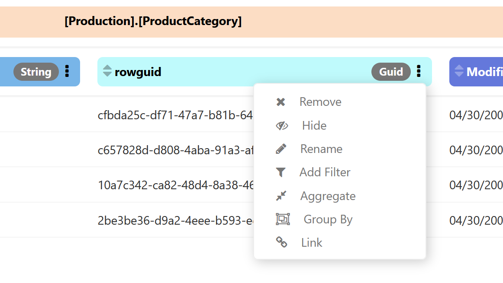
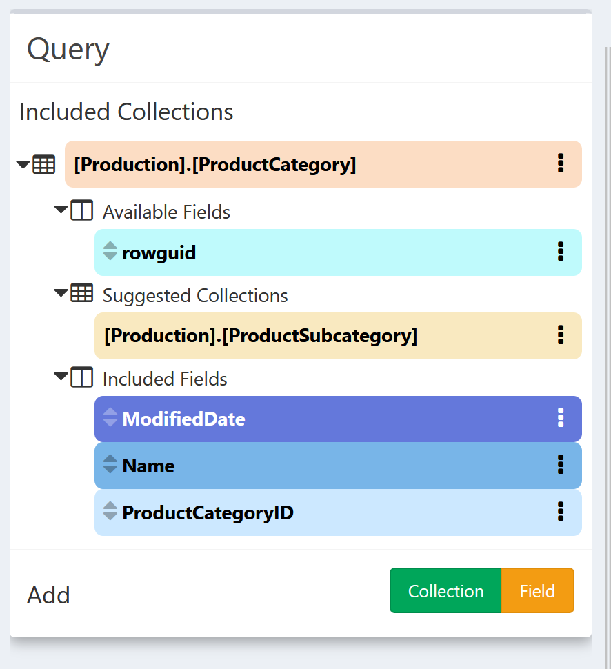
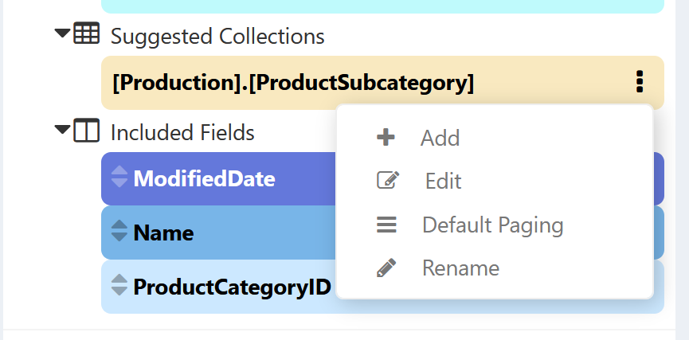
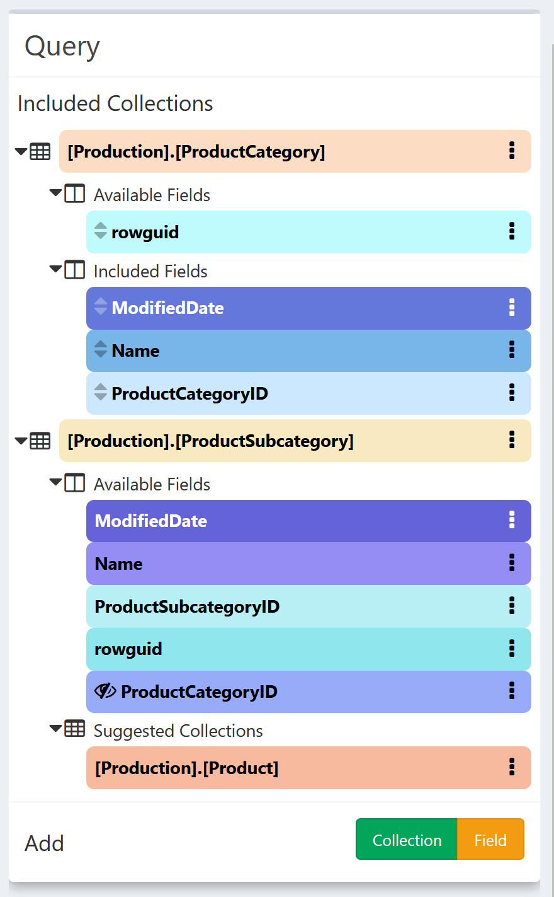
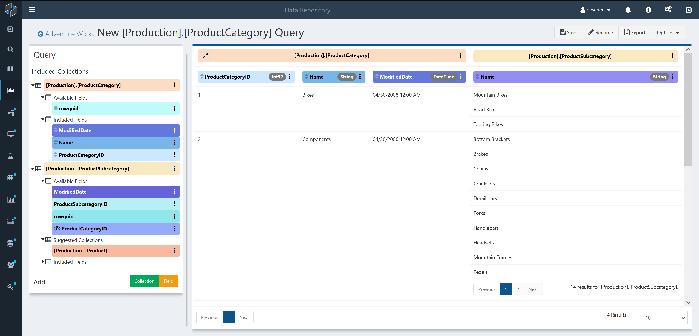
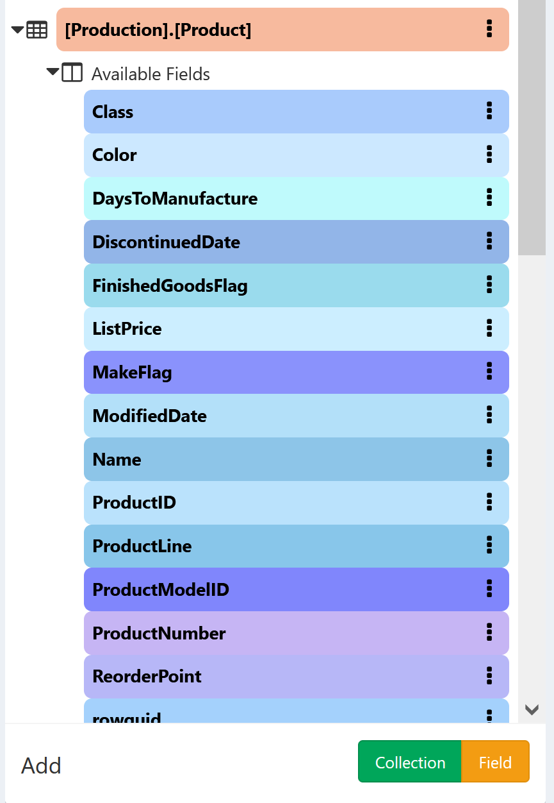
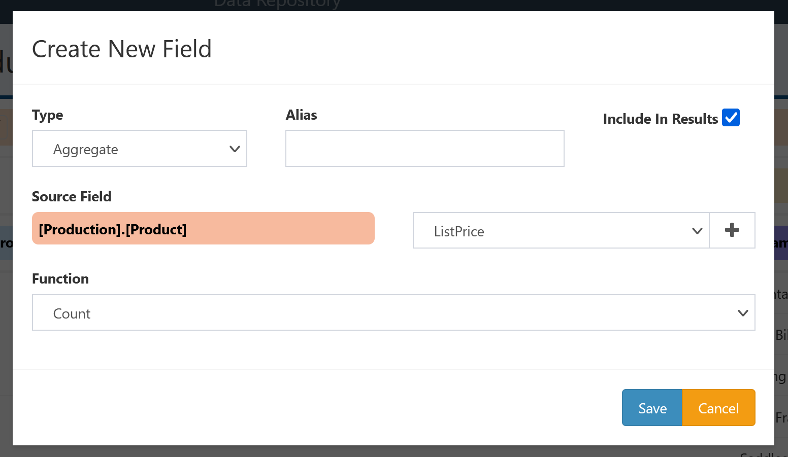

# Creating a DeepQuery

To create a new DeepQuery, [navigate](./Repository-Details.md#navigation) to any collection or field in a DataRepository. From there, click on the `DeepQueries` tab:

Click the "New" button to create a new query. The new query will open and execute:

This new query defaults to selecting the first page of results for all fields in the selected collection. In this case, the `[Production].[ProductCategory]` table from the [AdventureWorks](https://docs.microsoft.com/en-us/sql/samples/adventureworks-install-configure) database, there are only 4 rows of data so all data is displayed.

Now that we can see some of the data from our chosen collection, let's see how we can expand this query to discover more about the database and answer whatever questions we might have about the data.

## Modifying a DeepQuery

There are two main ways to modify a query: via interacting with the results panel headers and via the "Query" sidebar panel.

### Results Headers

The column headers above the query results tell you what data is being displayed. The bottom row shows the field being displayed in that column and the top row shows what collection each field belongs to. Both sets of headers are also interactive; the three-dots icon on the right hand side opens a menu with a variety of actions that can be taken on each field.

For example, suppose we're not interested in the `rowguid` column of `ProductCategory`; we can choose to [Remove](./Field-Menu-Options/Remove.md) it. Once we select that option, the query re-executes and we see the results without that field:

For details on all actions that can be taken on fields see [here](./DeepQuery-Details.md#field-menu-options) and for collections see [here](./DeepQuery-Details.md#collection-menu-options).

### Query sidebar

The sidebar to the left shows detailed information about the current state of the query while also providing several options for modifying the query.

The main feature of the sidebar is a list of all the collections included in the query. So far, our query only has one collection: `[Production].[ProductCategory]`. Nested underneath this collection we see three sections:

- Available Fields
    - These are fields that exist in the underlying data but aren't included in our query results. In this case that's just `rowguid`, which we removed from the default query.
- Suggested Collections
    - These are other collections in the repository that have a [Link](./Repository-Details.md#links) to the included collection.
- Included Fields
    - Fields that are included in the query results

The field and collection labels in the sidebar have the same control options that the results headers have, though the menu options may vary depending on the state of the field or collection. For example, since `Suggested Collections` aren't yet part of the query, they have an [Add](./Collection-Menu-Options/Add.md) option.

Selecting [Add](./Collection-Menu-Options/Add.md) will add the suggested collection to the query. Note that this does not automatically add any fields to the query, so the only change is in the sidebar:

We now have a whole new set of available fields, along with a new suggested collection. Let's [Add](./Field-Menu-Options/Add.md) the `Name` field and see how that impacts the query.

Because each `ProductCategory` has multiple `ProductSubcategories`, each row of our original results has now expanded to show all the results for that category. For the `Components` and `Accessories` rows there are more than 10 results, so their subcategory results are paged: use the paging controls to see the remaining results:

For more details on the paging behavior for collections, see [Default Paging](./Collection-Menu-Options/Default-Paging.md).

Notice that the new field `Name` appears under a new collection header: `[Production].[ProductSubcategory]`. For a more in-depth view of the structure of the query so far, click the double-arrow expand button on the left hand side of the `[Production].[ProductCategory]` header. This will expand the collection headers into multiple rows showing the nesting structure of the collections in the query.

## Adding Fields

Now that we have multiple collections and a better sense of what this data is, we can start to see questions we might want to answer. First notice that `[Production].[ProductSubcategory]` suggests another link to `[Production].[Product]`. Let's [Add](./Collection-Menu-Options/Add.md) that link and see what fields are available: 

`ListPrice` stands out as a field we might be interested in. One option would be to [Add](./Field-Menu-Options/Add.md) that field and see all the list prices for every product in each subcategory, but perhaps that's more data than we need right now. Instead, let's directly [Aggregate](./Field-Menu-Options/Aggregate.md) the field to generate a new field. Selecting this option will pop up a new window to define exactly what we want:

Because we started from a particular field, some information is already filled in. We've indicated we want to create a new [Aggregate Field](./Field-Types/Aggregate.md) using `ListPrice` from `[Production].[Product]` as the source. All that's left for us to do is select what aggregation function we want to apply to our source field, and to provide a nice alias for our new field. Let's select `Mean` for function to compute the average product price, and give it an alias `Mean Price`, then click `Save`.

The `Mean Price` column has appeared in `[Production].[ProductSubcategory]`, showing the average product price for each subcategory. We can order by `Mean Price` by clicking on the double-triangle icon on the left hand side of the column header; click once to order low to high.

Now we can see that the subcategory with the lowest average price is `Cleaners` in the `Accessories` category. For more details on ordering by fields, see [here](./DeepQuery-Details.md#ordering).

## Wrapping up

We've now generated a query that includes data from three separate tables while both discovering and answering a question about the underlying data. To be sure we can get back to this query and pick up where we left off next time, let's save the query. Before saving, it's probably a good idea to give it a better name: either click on `New [Production].[ProductCategory] Query` or the `Rename` button at the top of the page to edit the query name. Once you've changed the name; click the `Save` button to save the query. Now your query will be available on the `DeepQueries` tab of your [Repository Details](./Repository-Details.md#Queries) and any collection or field that's included in your query. For example, even though we started the query from `ProductCategory`, it also appears when we look at the `Product` queries.