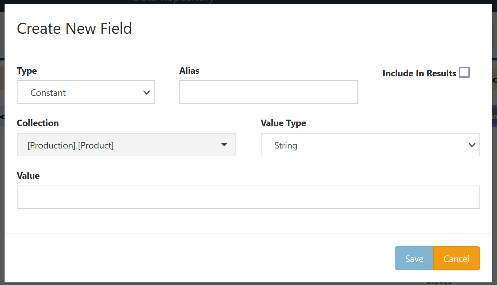

# Constant Fields

Constant fields return a single, constant value as a column in a particular collection. They are primarily used as part of the definition of other DeepQuery objects such as [collection link conditions](../DeepQuery-Details.md#adding-collections) or [condition filters](../Filter-Types/Condition.md).

## Creation

Constant fields can be added in several ways:

- Clicking the `Field` button in the `Add` section in the Query sidebar,
- Selecting the [Add field](../Collection-Menu-Options/Add-Field.md) option from a collection menu,
- Clicking the `+` button next to the dropdown menu allowing selection of an existing field when creating or editing some other DeepQuery object.

Any of these options will bring up a window for creating a new field of any type. To create a constant field, select `Constant` from the `Type` dropdown.

This brings up the configuration options for a constant field:

- **Alias**: Display name for the field. (optional)
- **Include In Results**: Whether to display the constant field in query results. Constant fields default to being hidden.
- **Collection**: Which existing collection to add the field to. This option will be pre-selected and uneditable if the field creation was triggered from a collection.
- **Value Type**: What type of data the constant will be. Depending on the underlying data source, conversions between types may happen automatically during query execution.
- **Value**: The literal value the constant field should return. This field is not editable if **Value Type** is `Null`.

Click `Save` to create the new field and add it to the DeepQuery. Click `Cancel` to close the window without creating the field.