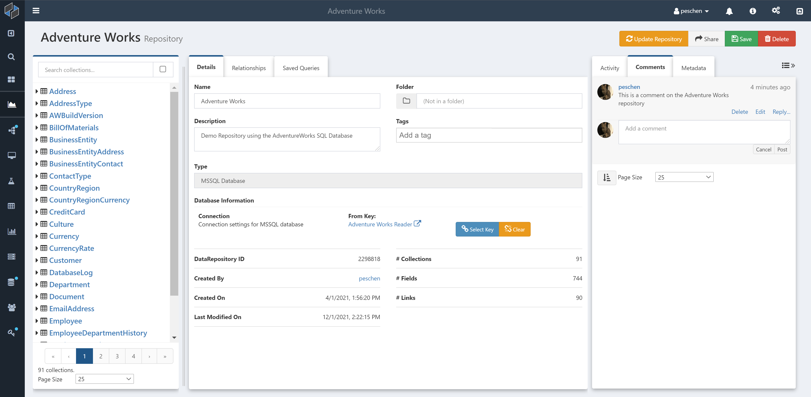
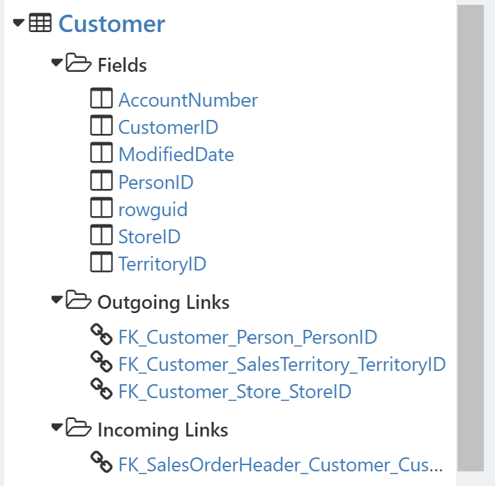
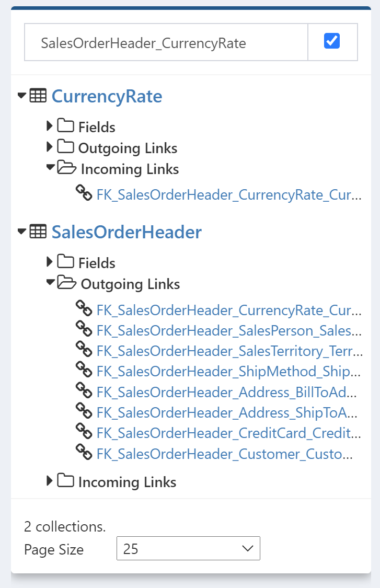
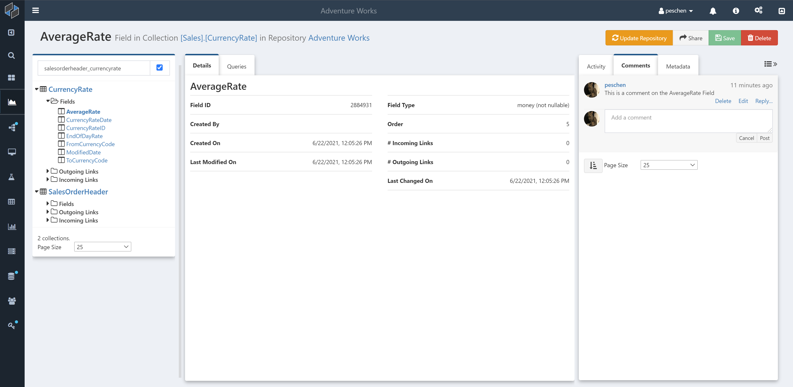

# Repository Details

The main landing page for a DataRepository shows high level information about the repository.

## Collections, Fields, and Links

On the left hand side of this view is a list of all the collections in the DataRepository. Collections are sets of data within the source repository; for a SQL Server database such as [AdventureWorks](https://docs.microsoft.com/en-us/sql/samples/adventureworks-install-configure), these are all the tables and views in the database. Expanding a collection by clicking the icon next to its name shows lists of the fields in that collection and any links to or from the collection.

Fields are the individual columns of data making up a collection, and links represent directed connections between collections. For SQL Server, links are foreign key relationships.

## Navigation

The tree view on the left hand side provides an overview of the collections, fields, and links in the repository, while also providing a way to navigate to any of those objects for additional details. Click on the name of an object to navigate to a page specific to the given object.

To find a specific collection, use the search bar to search by name. To also include field or link names in the search, check the checkbox next to the search bar.

### Collections

When viewing a collection, the details panel shows basic information about the collection, including a label for what type of collection it is (in this case `SQL Table`).

Note that the right hand panel now has comments on the `CurrencyRate` collection, rather than the repository as a whole.

### Fields

When viewing a field, the details panel shows basic information about the field. This information will vary depending on the data source underlying the DataRepository.

For a SQL Server database the information includes the SQL type of the column (in this case it is a not nullable `money` column) and the order of the column in its table.

### Links

When viewing a link, the details panel shows basic information about the link.

This information includes details about the fields involved in the link. For the case of a SQL foreign key these are the fields that are matched to each other between the two tables.

## Relationship Graph

For the DataRepository, and for every collection and link, the "Relationships" tab shows a visual network representation of the underlying data source. In this graph, each collection is represented by a node and each directed edge is a link.

The full repository view provides an overview of the structure of your data source, highlighting important tables that are related to many other tables, or clusters of different sections of tables with more connections between them.

This graph can be zoomed by scrolling or pinching, and moved by clicking on the white background and dragging. You can also grab the nodes and drag them around to get a clearer view if necessary.

The relationship graph also provides an alternate way to navigate the DataRepository; double-click on any node or edge in the graph to navigate to the page for that collection or link. The relationship graph will zoom in to a portion of the graph, showing only connections involving that collection or link. You can also view comments on that collection or link, or switch to another tab to view details or queries.

## Queries

In the "Saved Queries" tab for the DataRepository, you will find a list of [Composable QueryDives](./QueryDive-Overview.md) that you have created or that have been shared with you. New queries can be created from any collection or field, with the new query initialized by selecting data from that collection. Each collection or field also shows a list of all queries you have access to that reference that collection or field.