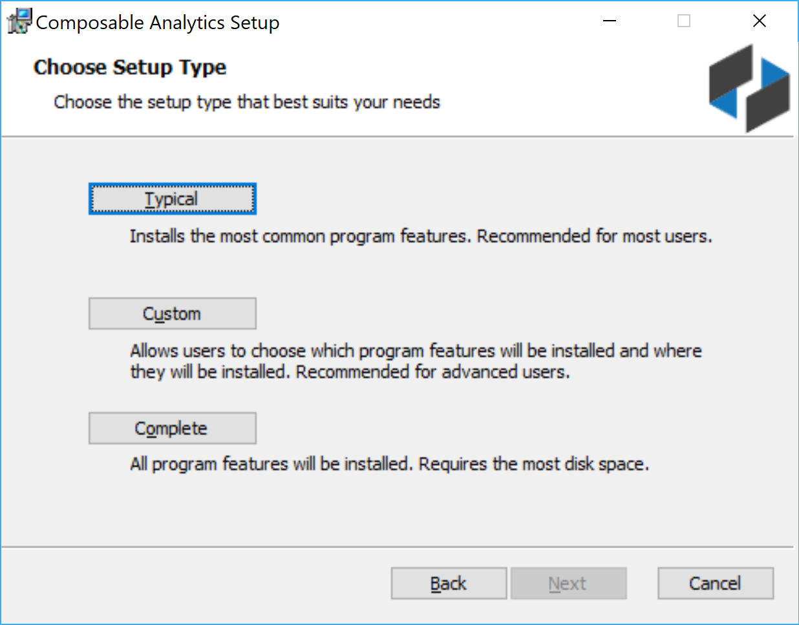
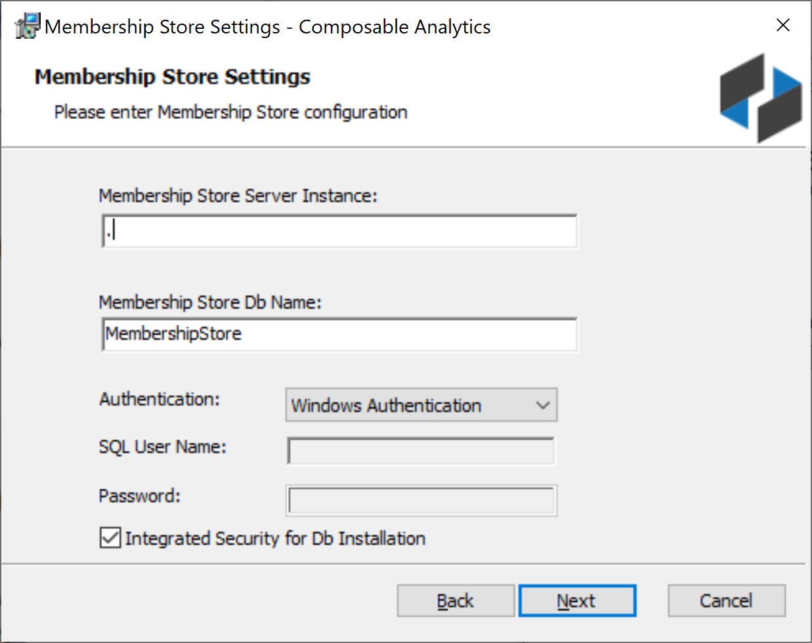
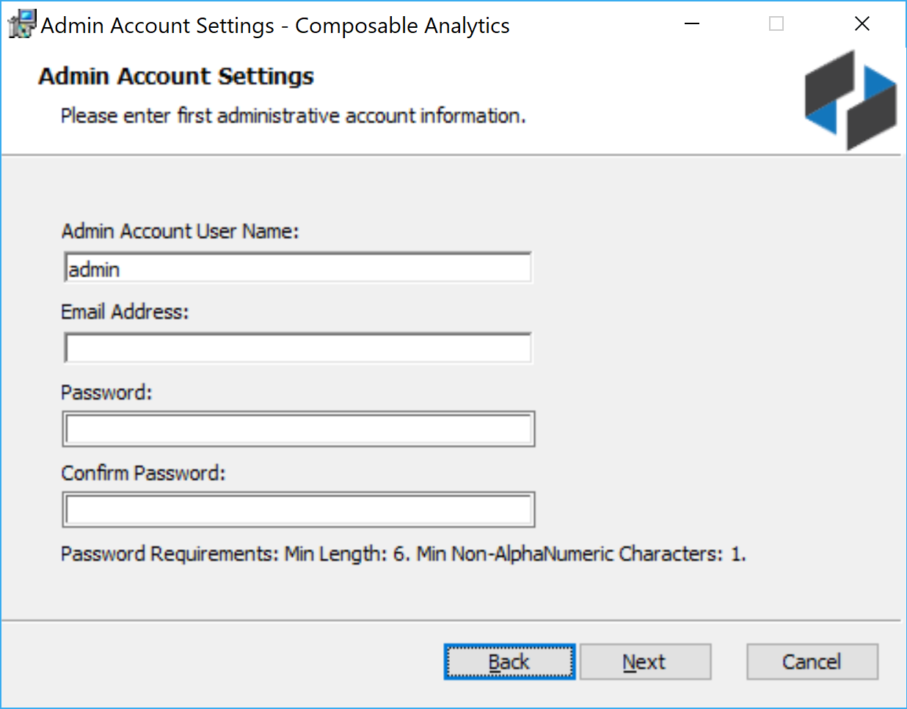
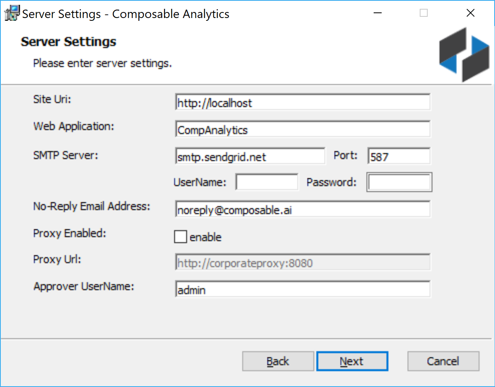
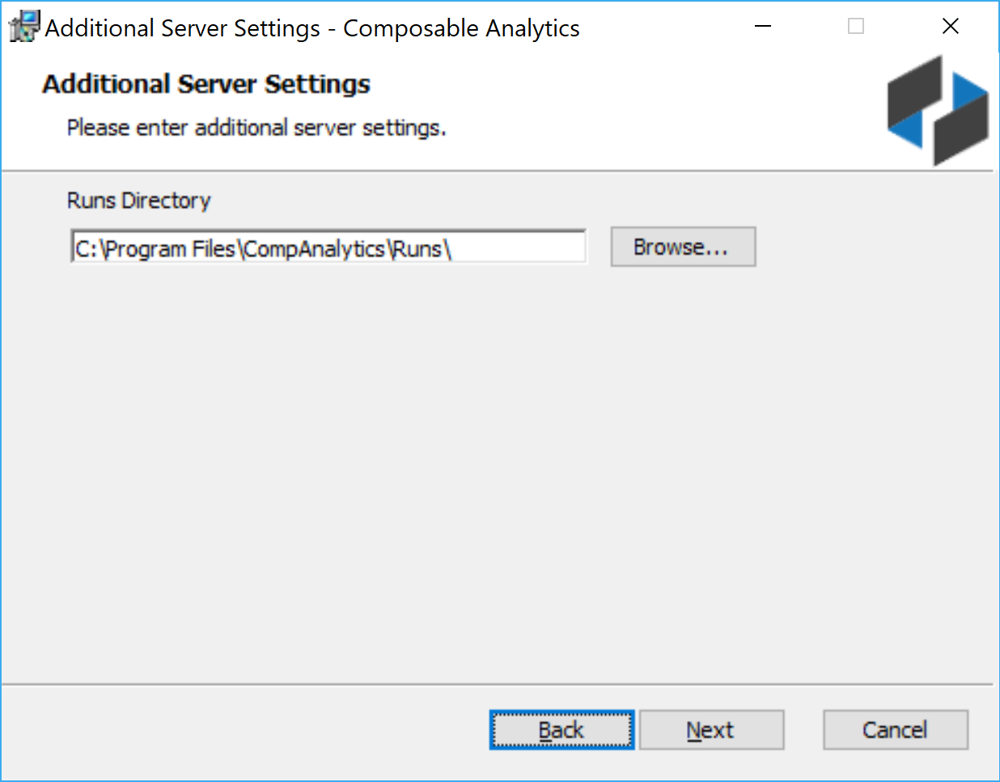
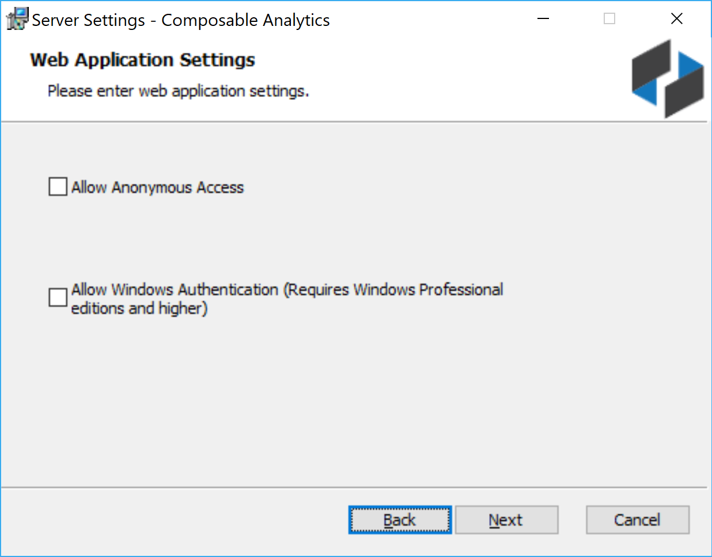

# Composable Installer GUI

The Composable Installer offers a GUI wizard that steps the user through the following installation steps:

1. Check system and software requirements.
    - The installer will check system requirements, space availability and automatically download and install any required software, such as a back-end database store. Specifically, SQL Server Express will be downloaded and installed as a back-end database if required. Composable will leverage the full-text indexer if you install SQL Server with advanced services.

    

2. With all system and software requirements met, the next steps in the Composable installation will be presented.

    

3. **End-User License Agreement**
    - You will be asked to accept the terms in the License Agreement. 

    

4. **Setup Type**

    - Installation options will be presented. For a single machine install, choose Complete. If you want to only install certain components, choose Custom.

    

    - The components include databases, NT services, and a web application.

    

5. **Membership Store Settings**
    - If using SQL Express, the local server and instance would be .\SQLEXPRESS. For the default host, it’s just “.”

    

6. **Admin Account Settings**
    - Enter a system administrator e-mail address, username and password. This will be the initial administrator of the system. Please keep a record of these credentials.

    

7. **Database Settings**
    - If using SQL Express, the local server and instance would be .\SQLEXPRESS. For the default host, it’s just “.”

    

8. **Server Settings**
    - Set the base path of the IIS web site. For a single / local machine http://localhost is fine. If on a corporate network, and you have a http proxy, set it here. An SMTP Server is also required to manage account registrations (e.g., e-mail registration confirmations and notifications).

    

9. **Additional Server Settings**
    - You can set the Composable Runs directory folder on this screen.

    

10. **Web Application Settings**
    - Anonymous Access: You can optionally choose to allow anonymous access. Anonymous users will be able to see any Composable resources shared with ‘Everyone’.
    - Windows Authentication: You can optionally choose to sync the Composable instance with Exchange / Active Directory to enable Single-Sign-On (SSO) in an enterprise settings.

    

11. **License File**
      - You will be prompted to cut/paste a license key here. Please contact info@composable.ai for a commercial license. If you do not currently have a license, you can continue with the installation, and activate your instance at a later time.

    

12. **Ready to Install**
      - After these options are set, you can begin the installation. The wizard will copy all the files to your local disk, configure all databases for you, and will turn on IIS and necessary components to run the web application.

    

