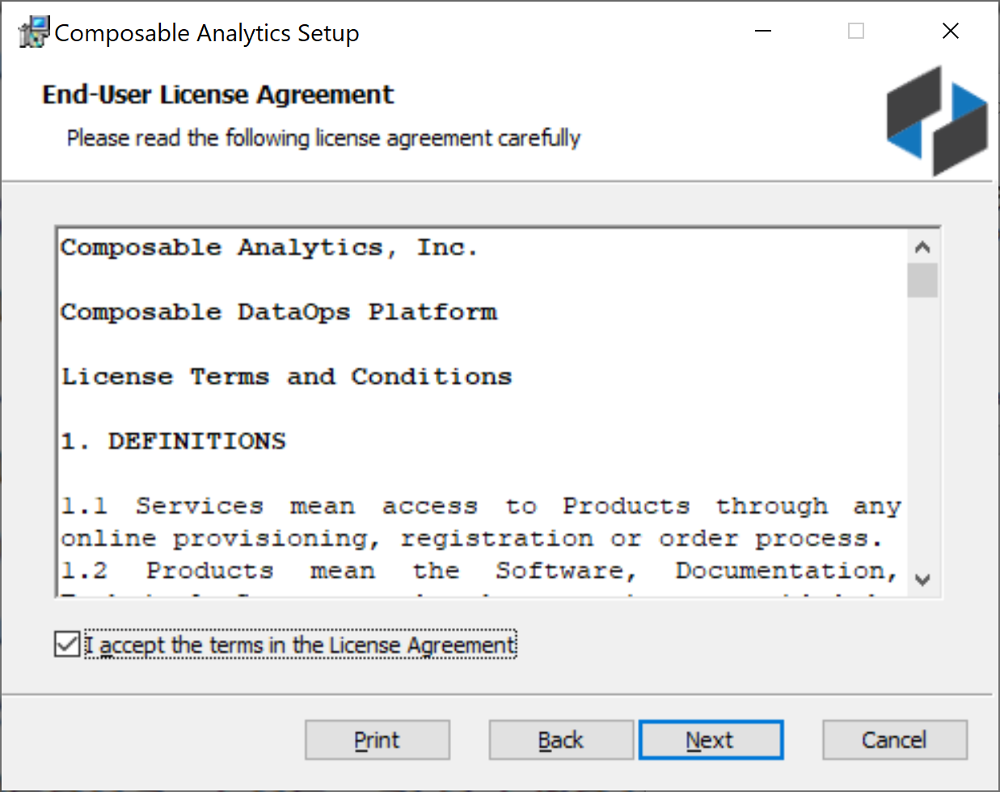
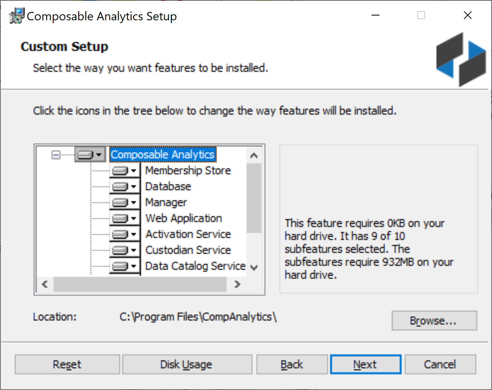
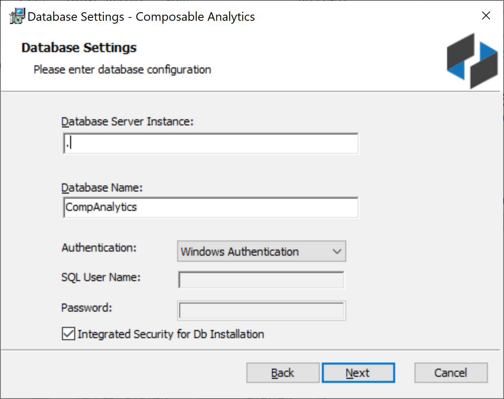

# Installation and Deployments

Composable is very easy to deploy in the cloud, within an on-premise datacenter or at the tactical edge.

The Composable platform has the following components:

- **Composable Activation Services**: The component that manages the activation and lifetime of the worker processes, including all runtime, deployment, and management activities for all Composable resources.
- **Composable Execution Engine**: The back-end component that executes Composable runs, and orchestrates all compute and data flows.
- **Composable Web Application**: The centralized web application of Composable.
- **Composable Back-End Databases**: The Composable Application and Membershib databases used for membership store, application metadata and persistence.

In an n-tiered deployment model, the above system components can be distributed across multiple nodes. For example, Composable can be deployed with a dedicated database server, a dedicated node for the activation services and execution engine, and a dedicated web application server. In this way, isolation of the data storage, computation, business logic and web layer leads to improved stability, perfomance and scalability.

## Cloud

Deployment on one of the public clouds (e.g., Azure, AWS) is simple and straightforward. Composable is available in the cloud marketplaces, see, for example, [Azure](https://azuremarketplace.microsoft.com/en-us/marketplace/apps/composable.composable?tab=overview) or [AWS](https://aws.amazon.com/marketplace/seller-profile?id=911f5969-ae5e-4de9-acca-b8f606972771). Simply follow the installation wizard on the portal to spin up a virtual machine with Composable already configured. For a detailed walkthrough of the process, please see [Public Cloud Deployment](/04.Public-Cloud-Deployment.md).

A development cloud instance is available for evaluation purposes. Please visit [cloud.composableanalytics.com](https://cloud.composableanalytics.com/), and begin by creating an account.

## On-Premise or Tactical Edge Installation

For development instances or tactical edge solutions, a single-tier architecture can be used, with all components deployed on a single node (e.g., server). For more complex deployments, a multi-tier approach can be configured for multi-machine and scale-out deployments.

Composable, including both first-time installations as well as platform updates, are handled via an installation wizard that guides system administrators through the required installation steps.

## Typical infrastructure

Composable is used to build *operational* data-intensive applications, and as such, multiple instances are commonly deployed to cover the full software development and application lifecycle, from development to production. For example, an enterprise deployment can nominally have one or more Composable instances:

- Development Instance: A dedicated Composable instance where Composable resources are developed and tested.
- Quality Assurance Instance: A dedicated Composable instance where all stakeholders can perform quality assurance.
- Staging Instance: A dedicated Composable instance, in an identical environment to that which is in Production, to test and finalize any configurtions needed in production.
- Production Instance: The *live* Composable instance, interacting with production data feeds and services and producing operational results.

## Upgrades

For on-premise installations and upgrades, a system admin can perform an installation or upgrade by simply following the Composable installation wizard. When upgrading an instance, an upgrade path is provided for Modules (see [Modules](../DataFlows/04.Modules.md)).

### Composable Installation Wizard

The Composable installation wizard will provide the following steps:

1. Check system and software requirements.
    - The installer will check system requirements, space availability and automatically download and install any required software, such as a back-end database store. Specifically, SQL Server Express will be downloaded and installed as a back-end database if required. Composable will leverage the full-text indexer if you install SQL Server with advanced services.

    
    
2. With all system and software requirements met, the next steps in the Composable installation will be presented.

    

3. **End-User License Agreement**
    - You will be asked to accept the terms in the License Agreement. 

        

    

    
4. **Setup Type**
    
    - Installation options will be presented. For a single machine install, choose Complete. If you want to only install certain components, choose Custom.
    
    
    
    - The components include databases, NT services, and a web application.
    
    
    
5. **Membership Store Settings**
    - If using SQL Express, the local server and instance would be .\SQLEXPRESS. For the default host, it’s just “.”

    

6. **Admin Account Settings**
    - Enter a system administrator e-mail address, username and password. This will be the initial administrator of the system. Please keep a record of these credentials.

    

7. **Database Settings**
    - If using SQL Express, the local server and instance would be .\SQLEXPRESS. For the default host, it’s just “.”

    

8. **Server Settings**
    - Set the base path of the IIS web site. For a single / local machine http://localhost is fine. If on a corporate network, and you have a http proxy, set it here. An SMTP Server is also required to manage account registrations (e.g., e-mail registration confirmations and notifications).

    

9. **Additional Server Settings**
    - You can set the Composable Runs directory folder on this screen.

    

10. **Web Application Settings**
    - Anonymous Access: You can optionally choose to allow anonymous access. Anonymous users will be able to see any Composable resources shared with ‘Everyone’.

    - Windows Authentication: You can optionally choose to sync the Composable instance with Exchange / Active Directory to enable Single-Sign-On (SSO) in an enterprise settings.

    

11. **License File**
    - You will be prompted to cut/paste a license key here. Please contact info@composable.ai for a commercial license. If you do not currently have a license, you can continue with the installation, and activate your instance at a later time.

    

After these options are set, you can begin the installation. The wizard will copy all the files to your local disk, configure all databases for you, and will turn on IIS and necessary components to run the web application.

