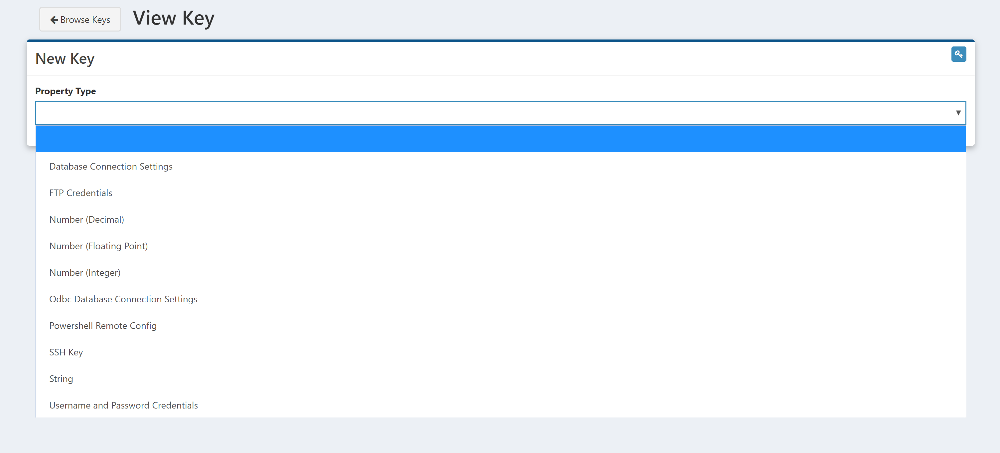
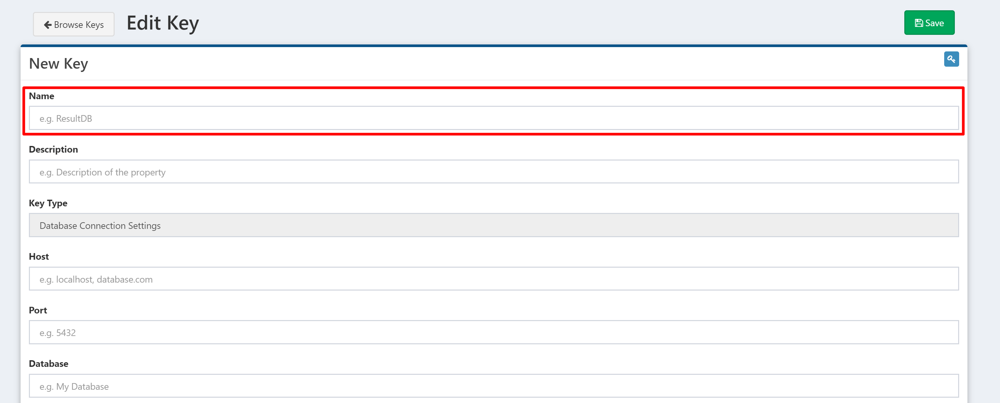
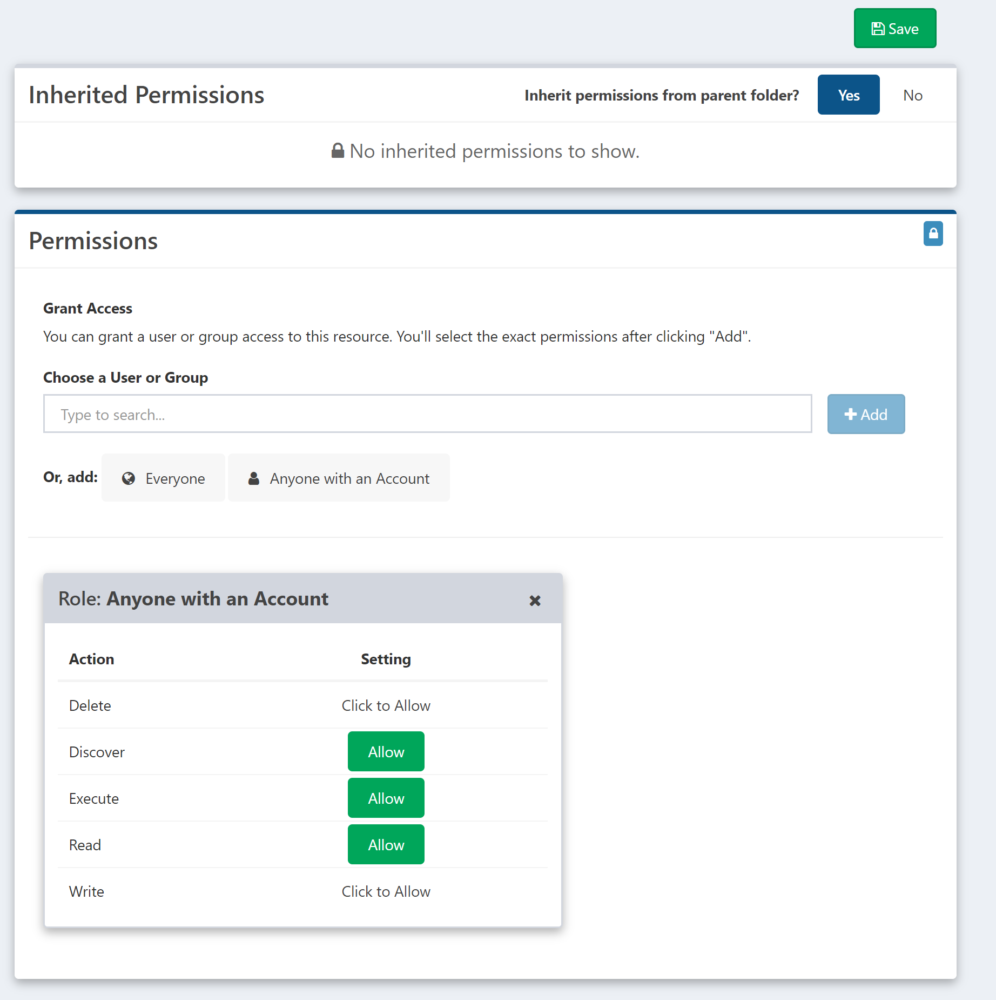

# Using Keys

Creating, Searching and Sharing Keys in Composable is extremely easy to do. To get started, simply click on the key icon in the sidebar:

Doing so, will open up your **Key Vault**, where you can browse all of your Keys (Keys you have created), as well as all Keys shared with you by other users.

## Creating a New Key

To create a new Key, simply click the New Key icon in the top right:

At this point, you will be given an option to select the type of Key you want to create:

As you can see, Composable provides the option to store all types of complex access credentials inside the Key Vault, including:

- **Database Connection Settings**: Used to store credentials in the form of username, password, port, database name and sql host to connect to a database server
- **FTP Credentials**: Used to store credentials in the form of username, password, port and ftp host, to access an ftp server
- **ODBC Database Connection Settings**: Used to store credentials in the form of username, password, port, database name and sql host to connect to a database server via a specific ODBC driver
- **Powershell Remote Config**: Used to store credentials in the form of username, password, port and host, to access a remote machine via Powershell
- **SSH Key**: Used to store SSH Private/Public Keys
- **Username and Password Credentials**: Used to store credentials in the form of username and password, needed for a variety of use cases

In addition to these specific Key types listed above, Composable also provides Key types to store:
- **Strings**
- **Integers**
- **Decimals**
-- **Floating-Point Numbers**

This is especially useful when developing multiple DataFlows that may require the use of these "global variables" (e.g., a string that stores a path to a shared network folder).

Once you select the Key type, a form appears to enter the relevant information based on the type selected (e.g., username, password, host, port, etc.). The name you enter in the Name field will be used to identify and retrieve the Key across the other Composable resources (e.g., DataFlows and QueryViews). Please be sure to use easy to remember and unique names.

!!! note
    Use easy to remember and unique names for your Keys, as this will be how your Keys are identified and retrieved across other Composable Resources.

Save your Key (upper right button) once you fill out all the required information.

## Sharing a Key

Composable Keys allow you to save all types of complex access credentials in a secure way. Most importantly, you no longer need to hard-code sensitive credential information in clear text in code or scripts, and you can also share Keys at a granular level (e.g., discover, execute, read, write) with Users and Groups.

To share a Key, open the Key and click on share in the top right:

Similar to the other access control pages for other Composable resources, you can now select individual Users, Groups, or Everyone and Anyone with an Account, and provide access to the Key at a granular level:

- Delete
- Discover
- Execute
- Read
- Write

