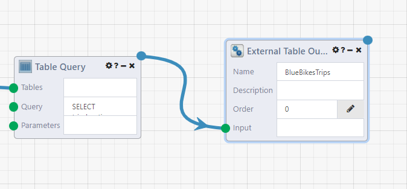
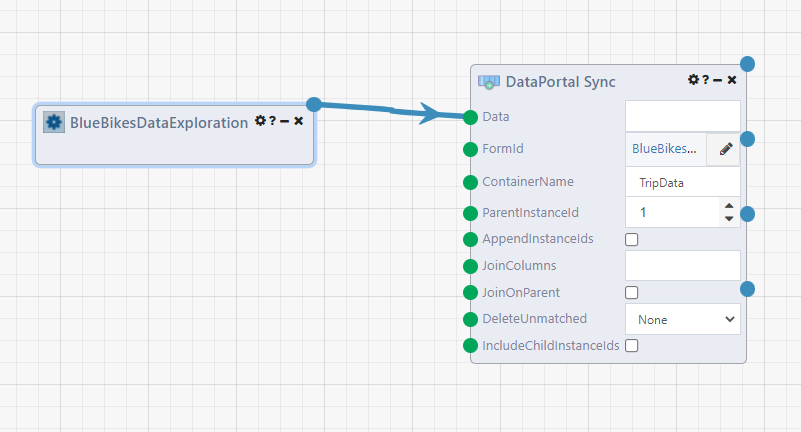

# Creating a DataPortal

 In an ETL pipeline, the next step after processing data from an external source is to put it in a data store (load). A [DataPortal](../DataPortals/01.Overview.md) makes setting up a database from the data model very simple.

In this tutorial, we will continue from the [Reading BlueBikes data](./ReadingBlueBikes.md) tutorial to use it as our dataset. We will set up a DataPortal, then use the [DataPortalSync](../DataFlows/09.Module-Details/DataPortalSync.md) to load the data into the database. This is so we now have a permanent store for our data, and an access point for other applications as well.

## The DataPortal Excel File

The DataPortal will have a similar structure to the "Simple Survey" example excel file that is available on the Create New DataPortal Page, since we are essentially creating one table in the database.

### Master  Sheet

In the [master sheet](../DataPortals/03.MasterSheet.md), we name the database, and use the `Link` ControlType to point towards the entry page of the DataPortal. As `Type`, enter `Form.BlueBikes` which points towards another sheet in the file.

 

### Master.settings (optional step)

[Settings pages](../DataPortals/06.SettingSheet.md) are optional. The heading fields are `Option, Value`. Here, we disable the AutoSave feature. With AutoSave enabled, when you start entering data on a DataPortal page, it is automatically saved, even if your entry is not complete. When it is turned off, you need to click the `Save` Button for the data to be saved. 

### TripData Container Page

We're going to skip over the `BlueBikes` sheet that we linked from the master page, and instead first create the container where we will be storing the trip data that we processed in the previous DataFlow. This is where we define the schema of the table, defining the names and datatypes. In our DataPortal, we also pick a ControlType for how to display these fields to a user entering in data.

Now go through each of the fields in the dataset, and list out their properties. In the [`Name`](../DataPortals/06.Setting-Details/Name.md) column, we want these to match our dataset exactly. Recall that in the DataFlow, we renamed these columns to format them and remove spaces. In the [`DisplayName`](../DataPortals/06.Setting-Details/DisplayName.md) field, we make them more readable. In the [`Type`](../DataPortals/06.Setting-Details/Type.md) column, we are mostly using C# System Types: integers for IDs, Doubles for decimals like latitude, strings for text and datetime for time fields. For UserType field of our data, we instead use a [`Category`](../DataPortals/05.Control-Details/Category.md) control type to limit the input values. We define the category values in the `UserType` sheet of our excel file. The other `ControlTypes` are selected based on the datatype of the field.

| [Name](../DataPortals/06.Setting-Details/Name.md) | [DisplayName](../DataPortals/06.Setting-Details/DisplayName.md) | [Description](../DataPortals/06.Setting-Details/Description.md) | [Type](../DataPortals/06.Setting-Details/Type.md) | [ControlType](../DataPortals/06.Setting-Details/ControlType.md) | [Required](../DataPortals/06.Setting-Details/Required.md) |
| ------------------------------------------------- | ------------------------------------------------------------ | ------------------------------------------------------------ | ------------------------------------------------- | ------------------------------------------------------------ | --------------------------------------------------------- |
| TripDuration                                      | Trip Duration                                                |                                                              | System.Int32                                      | [Spin](../DataPortals/05.Control-Details/Spin.md)            |                                                           |
| StartTime                                         | Start Time                                                   |                                                              | System.DateTimeOffset                             | [DateTime](../DataPortals/05.Control-Details/DateTime.md)    |                                                           |
| StopTime                                          | Stop Time                                                    |                                                              | System.DateTimeOffset                             | DateTime                                                     |                                                           |
| StartStationID                                    | Start Station ID                                             |                                                              | System.Int32                                      | Spin                                                         |                                                           |
| StartStationName                                  | Start Station Name                                           |                                                              | System.String                                     | [Text](../DataPortals/05.Control-Details/Text.md)            |                                                           |
| StartStationLatitude                              | Start Station Latitude                                       |                                                              | System.Double                                     | [NumberFormatting](../DataPortals/05.Control-Details/NumberFormatting.md) |                                                           |
| StartStationLongitude                             | Start Station Longtitude                                     |                                                              | System.Double                                     | NumberFormatting                                             |                                                           |
| EndStationID                                      | End Station ID                                               |                                                              | System.Int32                                      | Spin                                                         |                                                           |
| EndStationName                                    | End Station Name                                             |                                                              | System.String                                     | Text                                                         |                                                           |
| EndStationLatitude                                | End Station Latitude                                         |                                                              | System.Double                                     | NumberFormatting                                             |                                                           |
| EndStationLongitude                               | End Station Longitude                                        |                                                              | System.Double                                     | NumberFormatting                                             |                                                           |
| BikeID                                            | Bike ID                                                      |                                                              | System.Int32                                      | Spin                                                         |                                                           |
| UserType                                          | User Type                                                    |                                                              | Form.UserType                                     | [Category](../DataPortals/05.Control-Details/Category.md)    |                                                           |
| ZipCode                                           | Zip Code                                                     |                                                              | System.String                                     | [ZIP](../DataPortals/05.Control-Details/ZIP.md)              |                                                           |

Now let's go to the `Categories` sheet. so we can define the UserTypes we referenced as `Form.UserType`. Here, "UserType" is the header of a column of the Categories sheet. We add in the two values `Customer` and `Subscriber`.

### BlueBikes Container Page

Now let's go back to the `BlueBikes` sheet we referenced in the master sheet. Here we describe what to show as the main page of the DataPortal. We need to reference our `TripData` container, and list what columns we want to display. 

For Type, enter `[Form.TripData]`.

Under `Columns` enter: `[Form.TripData.TripDuration, Form.TripData.StartTime, Form.TripData.StopTime, Form.TripData.StartStationID, Form.TripData.StartStationName, Form.TripData.StartStationLatitude, Form.TripData.StartStationLongitude, Form.TripData.EndStationID, Form.TripData.EndStationName, Form.TripData.EndStationLatitude, Form.TripData.EndStationLongitude, Form.TripData.BikeID, Form.TripData.UserType, Form.TripData.ZipCode]` 

Optionally, the column `SearchBoxes` set to `TRUE` will allow us to search on a column level, such as to only view data for a specific bike id or station.

### Upload DataPortal

On the New DataPortal page, either click the `Choose File` button, or drag your file over to the upload box, and in the background Composable creates your database. Once it's finished processing, click on the `Open DataPortal` button and you'll be brought to the homepage of your DataPortal, which will look empty, since we haven't added any data.

## Inserting Data with the DataPortal Sync Module

In the DataPortal, we can manually enter in entries one by one. In this case, we want to add a batch of data to our database, which can be done with the [DataPortalSync](../DataFlows/09.Module-Details/DataPortalSync.md) module. The DataPortalSync module takes care of auditing changes to the database table and well as transforming category fields to an integer lookup.

To start, go back to the data ingestion DataFlow, and add the `ExternalTableOutput` to the last module. This allows us to run the DataFlow and access the table [from another DataFlow](../DataFlows/06.DataFlow-Reuse.md). We are separating out the two functions of extracting our data and loading it to the database, so other processes could also read in the data and run transformations without the DataPortalSync module running every time.

Next, create a new DataFlow, which will have two modules. The first is our previous module. In the module sidebar, go to `My DataFlows` or `Search All DataFlows` and enter in the DataFlow name (exactly). You can also search without any search keyword to bring up all applicable DataFlows. After adding the module to the designer, you can see it has one output node, which was added from the `External Table Output` module. Running this module runs the DataFlow that it references. You can also click on the module name, which will open up the referenced dataflow in a new browser.

Add in a `DataPortal Sync` module and connect the output of the previous module to the DataModule. In the `FormID` selector, select the DataPortal that was created earlier. `ContainerName` is `TripData` (the sheet name in the DataPortal excel file). And ParentInstanceId is 1. Click on the question mark for the module details, that explains more about how the DataPortal Sync module runs.

Run this DataFlow and you will see updates in the Trace Log at the bottom with how many rows have been inserted. (It'll take a while, it's a large dataset.) And then we're done.

With an excel file, and a 2 module DataFlow, we've created a database and inserted data, without any SQL code written.

!!! note
    If you have a key with credentials to write to your DataPortal, the `ODBC Insert` module can work, but does not include all of the features that are included with a DataPortal so it is not recommended. The DataPortalSync module transforms category data into the lookup key, and also provides auditing on data changes. For instance, your container database table also includes the following columns `AclId, CreatedById, CreatedByUserName, CreatedDateTime`.

## Next Steps

DataPortals can be referenced in other Composable tools. A [DataRepository](../DataRepository/01.Overview.md) can connect directly to a DataPortal id and show you a database diagram with tables connected by primary and foreign keys. With database credentials, create a [Key](../Keys/01.Overview.md) for the connection, and then you can create [QueryViews](../QueryViews/01.Overview.md) to query the data and share the results.

