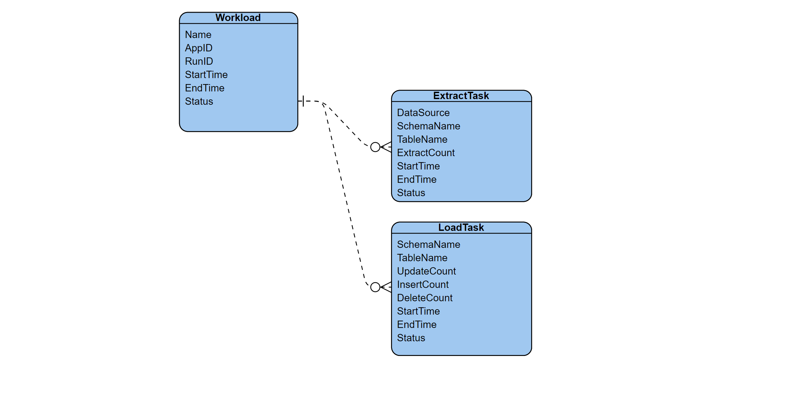
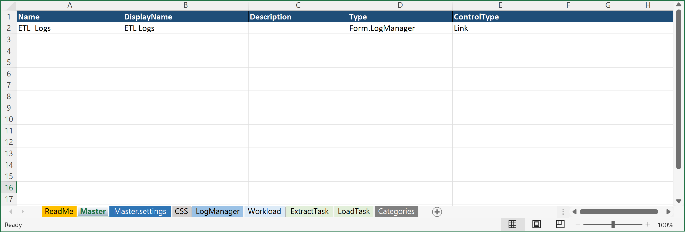
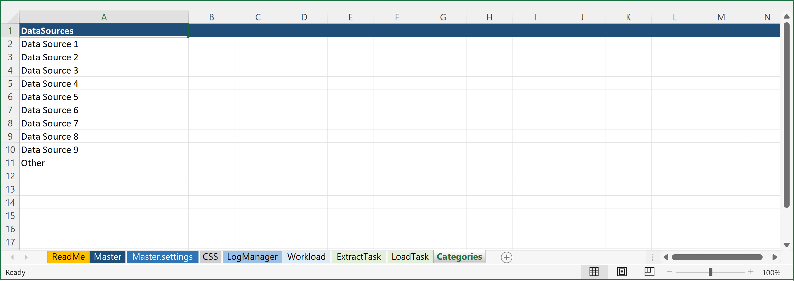
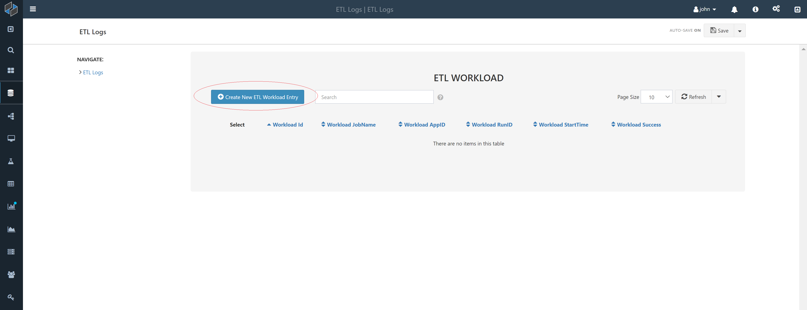
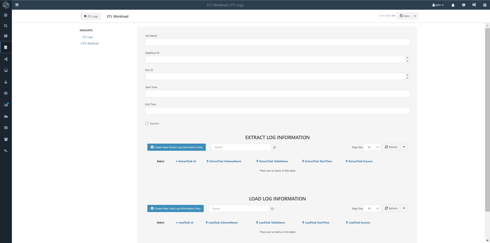
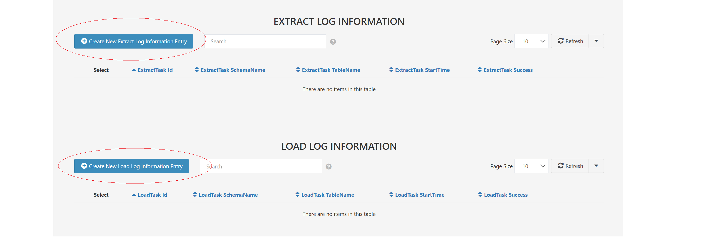
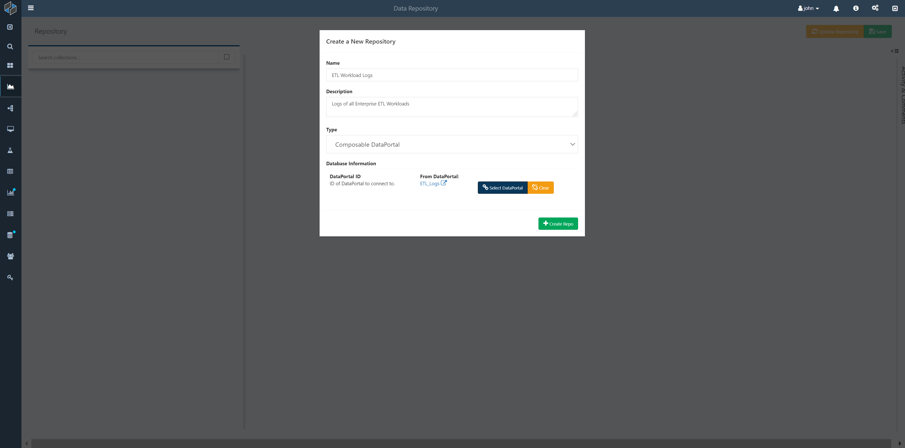
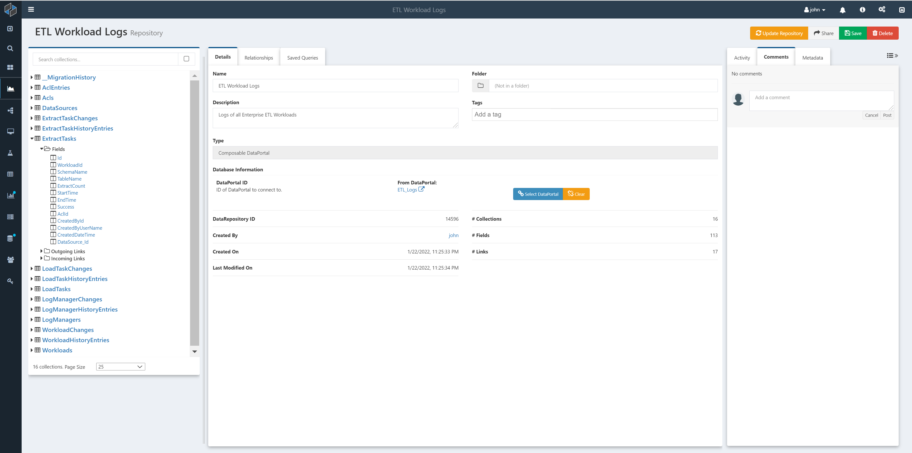
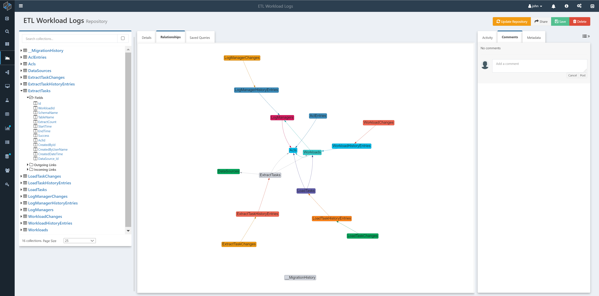
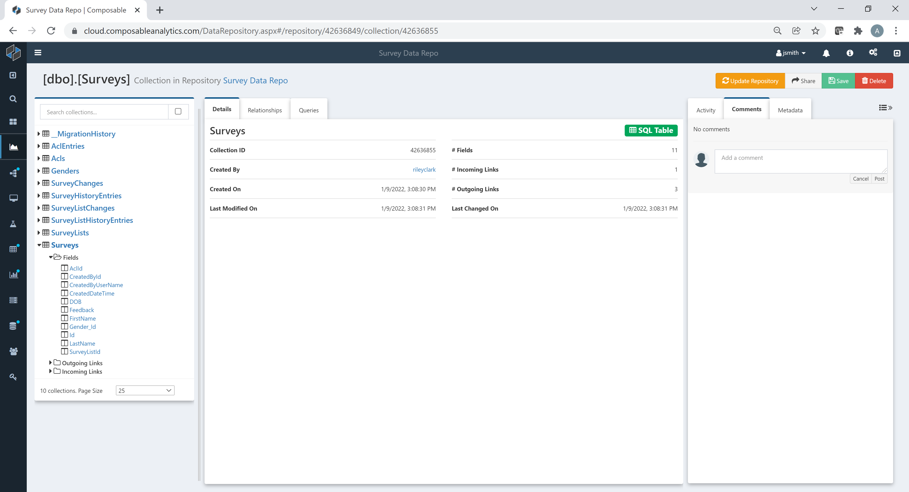

# Introduction

In this tutorial, we will create a [DataPortal](../DataPortals/01.Overview.md) that will be used to capture logs for Extract, Transform, and Load (ETL) workloads. ETL is a term used to define data orchestration processes that begin with extracting data from a source system, optionally transforming that data in some way, and finally loading the transformed data into the target location. For example, an organization may collect real-time customer transactions in an operational OLTP database, but may wish to analyze this data in a more performant OLAP database that is optimized for large-scale data analytics. So they may employ one or more ETL workloads to extract the data from the transactional database (source), transform it so that it fits the target data model, and then load it into the OLAP database (target).

Enterprises typically manage tens, hundreds, or even thousands of ETL workloads. Therefore, maintaining accurate, and queriable, logs of these processes is critical for enterprise data management. Composable [DataFlows](../DataFlows/01.Overview.md) lend themselves well to ETL workloads, given their flow-based approach to data orchestration. Similarly, Composable [DataPortals](../DataPortals/01.Overview.md) can automatically generate a back-end data store for all ETL logs, and Composable [DataRepositories](../DataRepository/01.Overview.md) can provide an effective approach to monitoring and querying the logs.

## ETL Worload Logging

This tutorial will walk through the use of Composable to rapidly develop logging and monitoring infrastructure for enterprise data management.  Specifically, we will:

- Define a data model that will capture ETL workload logs
- Create a [DataPortal](../DataPortals/01.Overview.md) which will automatically generate our back end database, ORM layer and web interface
- Create a [DataRepository](../DataRepository/01.Overview.md) to query and view the logs that are captured
- Define ETL workloads using [DataFlows](../DataFlows/01.Overview.md), with syncing of logs to the [DataPortal](../DataPortals/01.Overview.md)
 
## Defining the Data Model

For the purpose of this tutorial, we will be focusing on capturing high-level logs of ETL workloads. Specifically, logs of the given workload and its data extraction (as data is pulled from the source system) and data loading (as data is loaded into the target system) tasks. Our data model will therefore have three core entities that we will name Workload, ExtractTask and LoadTask.

The basic relationship of our data model is that a given Workload can have one or more ExtractionTasks and one or more LoadTasks. The ER model for this is shown below.



Common fields usually captured for logs include:

- Start and stop events: The beginning and ending timestamp for the ETL workload, as well as that of the individual extraction and loading tasks
- Status: The status (e.g., succeeded, failed) of the full workload and individual tasks.
Errors and other exceptions. Logging failures and anomalies is often the most time-consuming part of building a logging infrastructure. It’s also the part that yields the most value during testing and troubleshooting.
- Audit information: This can include the name and ID of the ETL workload, the specific run identificaton or username (or service account name) that initiated the workload, and other useful information, such as the number of rows loaded in each task.

If desired, our data model can be further expanded as needed to capture even more task-level details and transformation steps within an ETL workload.

## The DataPortal Model File

We will be using a Composable [DataPortal](../DataPortals/01.Overview.md) to implement our back-end database and front-end web interface. As noted elsewhere in the Docs, all DataPortals start with a data model that is defined in an Excel workbook. The Excel model file used in this tutorial is available here: <a href="../../Tutorial/img/DataPortals_Model_ETL_Logs.xlsx" download="DataPortals_Model_ETL_Logs.xlsx">Download ETL Logs DataPortal Model (xlxs)</a> 

## The Master Container

First, we create a [`Master`](../DataPortals/03.MasterSheet.md) sheet that points to the container we would like to use as the root of our logs. We'll point it to `LogManager` container we will define in the next step.

We will set the [`Name`](../DataPortals/06.Setting-Details/Name.md) of our DataPortal (and the name of the database that will be created to store its data) to `ETL_Logs`, [`DisplayName`](../DataPortals/06.Setting-Details/DisplayName.md) to "ETL Logs", [`Type`](../DataPortals/06.Setting-Details/Type.md) to `Form.LogManager`, and [ControlType](../DataPortals/06.Setting-Details/ControlType.md) to [`Link`](../DataPortals/05.Control-Details/Link.md).

Our [`Master`](../DataPortals/03.MasterSheet.md) sheet is shown below.



## The LogManager Container

With our Master sheet defined, we will now create a parent container called `LogManager` that allows us to create multiple workload log instances, creating a one-to-many relationship in our data model. Here, we use the ControlType [`Table`](../DataPortals/05.Control-Details/Table.md), indicating that we would like a table of all the workload log instances that we will capture. Note that the data type for the Table field is `[Form.Workload]`, with brackets indicating an array of our Workload container (which we will define next). We also pick out some of the fields from our Workload container to be displayed in the table, via the [`Columns`](../DataPortals/06.Setting-Details/Columns.md) column shown below in the last column on the right.


## The Workload Container Page

The Workload Container will be a new sheet in the Excel DataPortal Model File called **Workload**. For our ETL workloads, we will capture the following attributes as fields in our table:

| Workload            | Description                                           |
|---------------------|-------------------------------------------------------|
|Name    	          | The name of the workload                              |
|AppID   	          | The unique ID of the DataFlow Application             |
|RunID  	          | The unique ID of the Run of a DataFlow Application    |
|StartTime            | The start time of the workload                        |
|EndTime	          | The end time of the workload                          |
|Status	              | The status (success or failed) of the workload        |

The screenshot below shows our design for the "Workload" page. 


## The ExtractTask Container Page

Similarly to the Workload Container, we will create a new sheet in the Excel DataPortal Model File called **ExtractTask**.

For our ExtractTask entity, we will capture the following attributes as fields in our table:

| ExtractTask           | Description                                           |
|-----------------------|-------------------------------------------------------|
|DataSource	            | The name of the source system                         |
|SchemaName	            | The name of the source schema                         |
|TableName	            | The name of the source table                          |
|ExtractCount           | The number of rows extracted                          |
|StartTime	            | The start time of the workload                        |
|EndTime	            | The end time of the workload                          |
|Status	                | The status (success or failed) of the workload        |

## The ExtractTask Container Page

And finally, we will create a new sheet in the Excel DataPortal Model File called **LoadTask**.

For our LoadTask entity, we will capture the following attributes as fields in our table:

| LoadTask        | Description                                           |
|-----------------|-------------------------------------------------------|
|SchemaName	      | The name of the target schema                         |
|TableName	      | The name of the target table                          |
|UpdateCount      | The number of rows updated                            |
|InsertCount      | The number of rows inserted                           |
|DeleteCount      | The number of rows deleted                            |
|StartTime	      | The start time of the workload                        |
|EndTime	      | The end time of the workload                          |
|Status	          | The status (success or failed) of the workload        |

## The Categories Sheet

Note the special Type present for the `DataSource` field in the `ExtractTask` sheet. Here, the `ControlType` is a [Category](../DataPortals/05.Control-Details/Category.md), which gives us the ability to define a drop-down list of options. We can define this list of options in a separate sheet in the Excel workbook, called `Categories`. The `Categories` sheet is a special container that allows use to define all of your drop-down lists in a single column each, with the name of the list in the first row, and that can then be referenced as a Type via the `Form.<ListName>` syntax.

In this example, the [`Categories`](../DataPortals/05.Categories.md) sheet defines just one Category list: DataSource. We reference this in our ExtractTask container as `Form.DataSources`. So we make "DataSources" the header of a column of the [`Categories`](../DataPortals/05.Categories.md) sheet, and we can list out several values.



This completes the design of the data model.

## Upload DataPortal

To build the DataPortal, simply upload the Excel workbook to Composable.

To upload the DataPortal model file (Excel Workbook), create a new DataPortal and either click the `Choose File` button, or drag your file over to the upload box.


In the background Composable creates your database. Once it's finished processing, click on the `Open DataPortal` button and you'll be brought to the homepage of your DataPortal, which will initially look empty, since there is no workload log data yet that has been added.


## Navigating the DataPortal Web Interface

The initial view of the DataPortal will be the "table of workloads" we defined. Specifically, we will see here a table with the following columns, as we defined in the **LogManager** `Columns` cell: Id, JobName, AppID, RunID, StartTime, Success.

We can create a new "workload entry" using the "Create New Workload Entry" button.


After creating a new Workload entry, we are presented with the Workload fields for this new entry. Note that the ExtractTask and LoadTask Entities are tables, given that we defined them in the **Workload** sheet as **Form.ExtractLog** and **Form.LoadLog**. In this way, a workload can have zero, one or more of each of these tasks.

The tables for these tasks have a header column that is defined in the `Columns`cell: Id, SchemaName, TableName, StartTime, and Success.



We can create one or more ExtractTask and LoadTask entries, in the same way we created a new "workload entry" using the respective buttons.



### Optional Styling

The web interface can be styled with custom styling rules, written in CSS, to change the design.

We can add an optional sheet called `CSS` and enter custom CSS rules to style the pages with any colors, margins or other custom style behavior.



Try using the following CSS code:

``` css
    .form-field label { font-size: 1.6rem; color: #002d62; } 
    .container-group-level-0:not(.tab-container) { background: none; }
    .form-label-field { padding-bottom: 0; }
    .forms-top-bar-right-group { display: none; }
    div:forms-top-bar-left-group.col-md-10 {color:  #002d62; font-size: 3em;}
    h5.container-name-top { font-size: 3em; color: #002d62; }
```

Our Workload page will now look like this:



## Exploring the Back-end Database

Now that our front-end is taken care of, let's see what Composable generated under the hood to store our responses. 

We can create a Composable [DataRepository](../DataRepository/01.Overview.md) for our DataPortal to view and query the back-end database directly.

!!! note
    A [DataRepository](../DataRepository/01.Overview.md) can connect directly to a DataPortal id and show you a database diagram with tables connected by primary and foreign keys.



The DataPortal's back-end database includes not just the entities and fields we defined, but additional entities, fields, and relationships that are automatically generated by Composable to support things like authentication, access control, and revision history.



The [DataRepository](../DataRepository/01.Overview.md) can be used to explore and query the ETL workload logs.



## Next Steps

So far, we have covered how to define a new data model for ETL Workload logs, utilizing Composable [DataPortals](../DataPortals/01.Overview.md) to automatically generate a back-end data store, ORM layer and web interface and Composable [DataRepositorys](../DataRepository/01.Overview.md) to query and view the logs that are captured.

While the DataPortal Web Interface provides a full, responsive CRUD (Create, Read, Update, Delete) interface (and we show above how to manual use this interface to create new entries), we will want to automatically capture logs ***as part of*** the ETL workload. To do this, we can define ETL workloads using [DataFlows](../DataFlows/01.Overview.md), with syncing of logs to the [DataPortal](../DataPortals/01.Overview.md). We can use the [DataPortal Sync](../DataFlows/09.Module-Details/DataPortalSync.md).