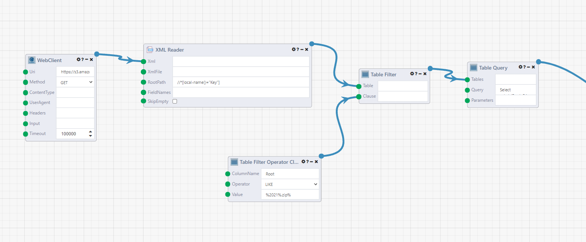
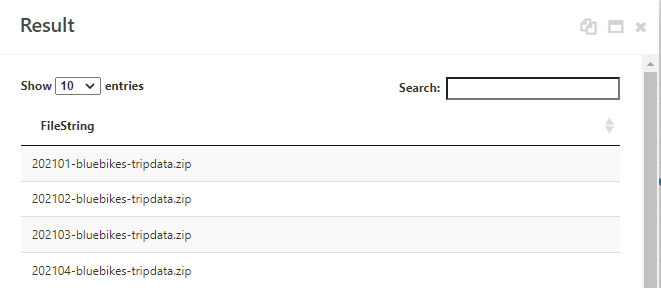
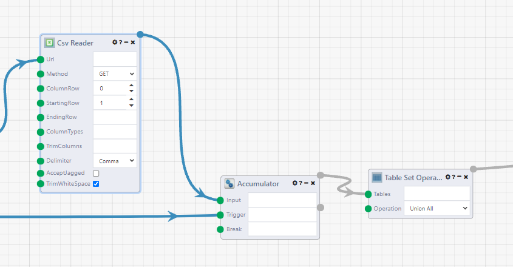
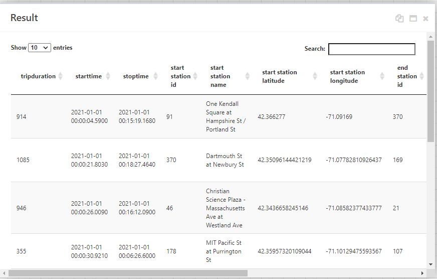

# Reading Data from the Web

One of the most common steps in any analysis process is to collect and read in your data. This may come from files, an API call, a database query or many other ways. In this page, we'll show an example of reading in data from the web into a Composable Table.

The dataset we'll be using is the [BlueBikes](https://www.bluebikes.com/) trip data. BlueBikes is the bike share system in Boston, and they have the entire trip history for rides taken since they first started in 2014. This is a publicly available dataset.

[BlueBikes Data Documentation](https://www.bluebikes.com/system-data) 

[BlueBikes Historical Trip Data](https://s3.amazonaws.com/hubway-data/index.html)

Here is the DataFlow that you can import into the DataFlow Designer page to follow along. <a href="../../Tutorial/img/BlueBikesDataExploration.json" download="BlueBikesDataExploration.json">Download Reading BlueBikes Data DataFlow</a> 

### Getting the List of Filenames

To start, we want to read in the data which is stored as zip files. They have a fairly consistent naming convention `YYYYMM-<ProgramName>-tripdata.zip` and the full download link is https://s3.amazonaws.com/hubway-data/202101-bluebikes-tripdata.zip.  We could write a code script to generate these names, but if we pull the filenames directly from the page, we will not have to change any parameters when new data is added every quarter. Also, BlueBikes switched their name from Hubway in May 2018, so we would have to account for that.

So instead we can go straight to the source, and get the filenames directly. Open up a Composable DataFlow and start with the `WebClient`module. Enter `https://s3.amazonaws.com/hubway-data` as the Uri and set the Method to `GET`. This returns an XML string with the contents of the S3 buckets.



The `XML Reader`parses the results into a table. Connect the result of the WebClient to the `Xml` input of the XML Reader. Enter `//*[local-name()="Key"]` as the `RootPath`. This is an XPath format. The rows in the output look like `<Key xmlns="http://s3.amazonaws.com/doc/2006-03-01/">201501-hubway-tripdata.zip</Key>`.

Now we can strip everything except the filenames, and filter to keep the files we want to process. To start, we only want to look at 2021 data, so a `Table Filter` module will filter the results. Attach the output of the XML Reader module to the `Table` input. Right click on the `Clause` input and it will suggest the `Table Filter Operator Clause` module. Set `ColumnName` to `Root`, `Operator` to `LIKE`, and `Value` to `%2021%.zip%` (Edit: do `%20210%.zip%` to not read in October data with a different format). This is SQL syntax, so the % are wildcard symbols. This query will filter to only zip files with 2021 in the field. 

!!! note
    Starting in October 2021, it looks like BlueBikes started releasing their data in a different format, with a tripID value, and changing the membership types. This will break the Union All happening later so for now, filter out data past this point. 

To extract the filenames from the rows, the `Table Query` module can be used to apply string functions. Enter the query below as the `Query`.

```sql
Select substr(Root, 54, instr(Root,'.zip')-50) AS FileString
FROM [t0]
```

Viewing the results shows that we now have a table of the zip filenames.



### Reading in the Files

Next we need to loop through the files and read them in, unzip them, and read the csvs inside into a table. 

Start off with the `Table ForEach` module. This starts a loop that iterates through each row of the module. Later, the `Accumulator` module will collect the results of the iterations of the loop.


The `TableRow Cell Selector` module gets the filename string from our table. Into a `String Input` module, add the base of the url `https://s3.amazonaws.com/hubway-data/`. Combine these in a `String Formatter` module with the Format `{0}{1}`. Make sure you connect the input modules in the correct order.

Connect this to the `Uri` input of the `WebClient File Fetcher` module. This is similar to the WebClient module used earlier, but instead the output is the location of where the file is saved on the composable server. Set the `Method` to `GET`. 

Now, we unzip the files. One thing to watch out for here is that one of the zip files `202104-bluebikes-tripdata.zip` also has a `__MACOSX` folder also included in it, which has a garbage csv file `._202104-bluebikes-tripdata.csv` inside, so we take some extra steps to filter it out, because the `Csv Reader` module will error.


Start with the `Unzip` module. This returns a dictionary of the files inside the zip directory. Use the `Named Dictionary Splitter` module to turn it into a list of KeyValue pairs. This allows us to loop through the list of the files and decide whether we want to read them in.

The `For Each` module creates the loop for each file. Connect the two `DataBinder Eval` modules. This module is named after the [.NET DataBinder Class](https://docs.microsoft.com/en-us/dotnet/api/system.web.ui.databinder?view=netframework-4.8). We are using it to parse the elements of the key value pair (or other objects). In the first, set the `Expression` to `key`. This is the csv filename. Set the second module's `Expression` to `value`, this is the uri of the file on the server.

The `Branch` module in the next step is like an if/else code block, except it outputs a different pathway for each result instead of just one result that changes based on the clause evaluation. Connect the 'key' DataBinder module to `Param1` input, and the 'value' one to the `Else` input. Set the `Condition` to `contains`, and `Param2` to `._` which is the start of the garbage filename. The Branch module will evaluate to False if is is a correctly named csv file. 

Finally, connect the `ElseResult` output (the second one) of the Branch module to the `Csv Reader` module. This will read in the csv file to a Composable Table where the table and other modules can operate on it.

As a side note, another way of getting this DataFlow to work would be to go to the Module Settings in the `Csv Reader` module and changing `Continue On Error` to False. The DataFlow will continue running, but not continue in the iteration where the module fails.

### Combing the Input Files into One Table

Now we combine the tables we got from the csv reader into one table.



First, connect the `Csv Reader` to an `Accumulator` module. This module acts as the end of our Table ForEach loop, and combines the its input results into one list. Connect the `Loop Complete` (second) output of the `Table ForEach` module to the `Trigger` input of the Accumulator module.

Then the `Table Set Operation` module with the operation set to `Union All` to combine the tables together. View the results of the module and you can see our data table.



As an optional step, column names with spaces in them can be annoying to deal with, so we can rename our columns with a `Table Query` module with the query as

```sqlite
SELECT
TripDuration,
StartTime,
StopTime,
[start station id] AS StartStationID,
[start station name] AS StartStationName,
[start station latitude] AS StartStationLatitude,
[start station longitude] AS StartStationLongitude,
[end station id] AS EndStationID,
[end station name] AS EndStationName,
[end station latitude] AS EndStationLatitude,
[end station longitude] AS EndStationLongitude,
[BikeID],
UserType,
[postal code] AS ZipCode
FROM [t0]
```

## Next Steps

Now that we have the data loaded in, we can start performing our analysis. There are several built-in table modules that can aggregate and perform other operations on your table, or use the `Table Query` module to query your data with sqlite syntax.

If you're building a data pipeline, and need to store your table in a database, you can set one up with a [DataPortal](../DataPortals/01.Overview.md) and use the [DataPortal Sync](../DataFlows/09.Module-Details/DataPortalSync.md) module.

The Visualizers dropdown of modules can also create charts.

