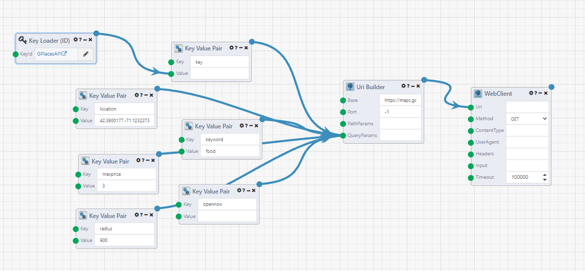
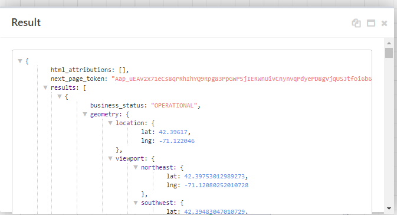
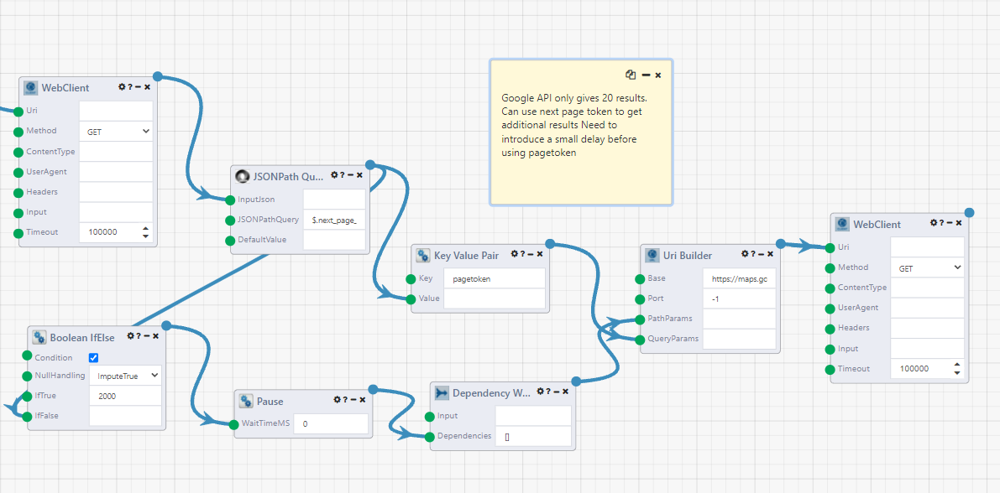
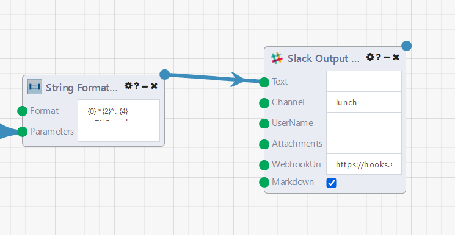
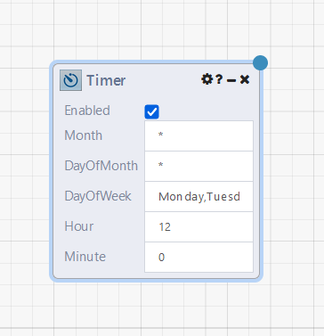

# Creating a DataFlow to Reccomend a Lunch Spot in Slack using the Google Maps Places API

 I think we all know the feeling when noon hits and it's time to decide where to get lunch. At Composable, this starts a discussion to see what everyone is in the mood for, agreeing on a spot, then sending a link to our #lunch slack channel with the link to order. If you're bad at making decisions, the good news is that we get automate this easily in a Composable DataFlow! 

We'll be showing how to set up a DataFlow to call the Google Maps Places API to find nearby restaurants around our office, then parse those results to choose the lunch spot, then send a message to a slack channel with our result. We'll set this onto a schedule so DataFlow is activated to run every weekday at noon.

Our final Slack message will look like this


Here is the DataFlow that you can import into Composable to follow along and implement for your own slack channel. <a href="../img/" download="LunchRecommender.json">Download Lunch Recommender DataFlow</a> You will need to add your google cloud API key and Slack webhook as described below.

## Getting Started

For this project, you'll need an Google Cloud Console account and a Slack workspace where you can create a Slack App. 

First, you'll need to generate an API token on the Google Cloud Console. This is described in the [Google Maps documentation](https://developers.google.com/maps/gmp-get-started). After [logging in](https://console.cloud.google.com/), you'll also need to have billing set up on your account. We will only be making a few API calls each day, so this will fall well within the $200 monthly credit tier. Once logged in, create a Project, then in the sidebar, select "APIs and Services" then ["Credentials"](https://console.cloud.google.com/apis/credentials). Click on the "Create Credentials" button at the top and select API key. To help prevent unathorized use, you can restrict your API key to be restricted to the Places API.


## The Composable DataFlow

### Key Creation

The next step is to save your API token as a Key in Composable to keep it secure. In Composable, go to the sidebar and select `Key -> Manage Keys`. Click the `New Key` button in the top right. Our API key will be a `String` property type. Add a name and copy your API Key from the Google Cloud Platform into the `Value` field, then Save.


### Making the API Call



Now we can start creating a DataFlow to call Google Maps API. First we'll be using the [Nearby Search](https://developers.google.com/maps/documentation/places/web-service/search-nearby) to find places around our office, and later we will make a [Place Details](https://developers.google.com/maps/documentation/places/web-service/details) call to get more information about the restaurant that was selected. Google's documentation is easy to understand, so we can easily figure out what parameters we need to specify to find food spots nearby to the office. 

The base of the url will be `https://maps.googleapis.com/maps/api/place/details/output?parameters` where our output format will be `json`. We will start with a `Uri Builder` module and set the Base input to `https://maps.googleapis.com/maps/api/place/details/output`. The port will be `-1` so that no port will be specified for this link. Now we need to set our parameters with `Key Value Pair` modules that connect to `QueryParams` in the `Uri Builder`. The order of connection does not matter. We determined the filter parameters we wanted from reading the [API documentation](https://developers.google.com/maps/documentation/places/web-service/search-nearby).

To use our API key, add a `Key Loader (ID)` module, and click the pencil icon and select the key we added earlier. Connect this to the value of a `Key Value Pair` module. The other required parameter is the location, which we set to the coordinates of Composable's office. When you search a place on google maps, the coordinates will be in the url. For the other filters, we want to find places that are open (opennow), within a roughly 10 min walk of the office (distance,900 meters), are not too expensive (maxprice), and serve food (keyword). When testing, we can try out other keywords to see if it gives a better result set. The `Uri Builder` takes all of these inputs and formats them correctly to make the API call. 

| Key                 | Value Format               | Value                  |
| ------------------- | -------------------------- | ---------------------- |
| key (required)      | Key Loader Module          |                        |
| location (required) | \<Latitude\>,\<Longitude\> | 42.3900177,-71.1232273 |
| keyword             | \<string\>                 | food                   |
| opennow             |                            |                        |
| radius              | \<meters\>                 | 900                    |
| maxprice (optional) | 0-4                        | 3                      |

Next connect the `Uri Builder` to a `WebClient` module and set the Method to `GET`. This module makes the request to get information from the link we created. Try running the DataFlow now and right-click out the output of the `WebClient` module and View Results. We have the results of the API call! The Composable module has also formatted the JSON so that it is easy to read the returned results.



The API call is limited to return 20 results. We can make 2 more calls using the `next_page_token` and our API key as the parameters to get these results (this is an optional step). The `next_page_token` does not activate immediately, so we also need to introduce a short pause into the DataFlow before the next WebClient module executes. 



We use the output of the `WebClient` module from the previous step and attach it to a `JSONPath Query` module to extract the next_page_token. The JSONPathQuery is `$.next_page_token`. We then make this a Key Value Pair with the key `pagetoken` and create another uri with the `UriBuilder` module. The other QueryParam to add is our API key from the previous step. 

Usually, we want a module to execute as soon as it has received all of it's inputs, but in this case the API documentation states that there is a delay before the next page token is valid, so we will use the `Pause` module to create a dummy input into the Uri Builder module. Because the output of the JSONPath Query module cannot connect directly to the Pause module, we first use a `Boolean IfElse` module where it is always set to True, so the value in the `IfTrue` input will always be the output. This will be the amount of the delay, which connects to the Pause. Then the `Dependency Waiter` module is also used as a graph flow module, waiting for all of it's input modules to execute before it runs. We pass a null output to the Uri Builder. Then we have another WebClient module to make the API call for the next 20 results.

We can repeat this flow one more time, to get the maximum possible 60 results from the API call.

### Parsing the Results

In this step, we want to extract the `place_id` for each of the 60 results and then choose one randomly. Then we can make a [Place Details](https://developers.google.com/maps/documentation/places/web-service/details) API call to get more specific location and website information about the location, since the Nearby Places call only gives coordinates and name of the locations. 


As the name suggests, the `JSON To Table` module parses a JSON text and creates a table. The path for the place_id is `$.results.[*].place_id`. The `Table Set Operation` module with Union All set as the Operation, unions these three tables all together.

Now, we will randomly select a random row of these results. Since this is not a preexisting module, we use a `Python Code` module to use a python function to randomly select an integer out of the total number of rows in our table. You may need the administrator of your Composable instance to grant you access to the Python Code module, because it is not enabled by default. The `Table Count` module outputs the number of rows, and we use this as the input for the Python Code module. In the input code, any undefined inputs are assigned in order with the values of the inputs passed to the module. Then the `Function Name` field tells the module which function result will be passed to the output.

```python
import random
def randSelect(inputNum):
    return random.randrange(inputNum)
```

Finally, the `Table Cell Selector` module the get the value of a cell from our table. We know the column will be `place_id` and the row_number will the randomly generated result from the Python Code module. 

### Place Details API Call

The Nearby Search results does not have enough information about the chosen lunch spot, so we make another API call using the [Place Details](https://developers.google.com/maps/documentation/places/web-service/details) service. This returns results similar to what you would expect when using Google Maps, such as the full address, website and hours. This part of the DataFlow should look familiar, because we are doing another API call. The parameters are the place_id from the previous step, the `fields` we want the call to return about the location, and our API key. The fields we requested are `name,formatted_address,formatted_phone_number,website,url`. We will use these in our slack message. The url is a google maps link, so that we can easily look up how to get there directly from Slack. The `Base` for the Uri Builder is `https://maps.googleapis.com/maps/api/place/details/json`, so note that this is a different url from the earlier steps.


### Parsing the Results of the Places Details API Call

In this step, we will parse our JSON results, and then write a string which will be the Slack message.


The `JSON To Table` module is used again to parse the results of the API call. 

| JSONPaths                       |
| ------------------------------- |
| $.result.url                    |
| $.result.formatted_phone_number |
| $.result.name                   |
| $.result.website                |
| $.result.url                    |

Then the `Table Cell Selector` is used to grab the cell values. We also use an `External Object List Input` to write some fun intros for our Slack messages. The `Python Code` module here then selects one of those inputs.

```python
import random

def randListSelect(inputList):
    rand = random.randrange(len(inputList))
    return inputList[rand]
```

The `String Formatter` module takes all the inputs and creates a string. This is written in the Slack markdown format, so it can be formatted nicely. The `Format` we used is ` {0} *{2}*. {4} <{5}|Google Maps> {1} {3}` which will look like the following in Slack:


To know which input is which, hover over the input arrows from the modules. It will display which number was assigned, which is the order the modules were connected.

### Sending a Slack App Message

The next step is to send our text string as a Slack App message. First, we'll have to go to slack to create an App, and allow it to post to a channel in our workspace. Go to the [Slack Apps page](https://api.slack.com/apps) and Create a New App. Selecting "From scratch" or "From an app manifest" are both fine. If using a manifest enable webhooks, shown below. 

```yaml
oauth_config:
  scopes:
    bot:
      - incoming-webhook
```

Webhooks can also be turned on in the by going to "Incoming Webhooks" in the sidebar, and setting the toggle to "On". Then Select "Add New Webhook to Workspace" at the bottom of the page and select which channel you want your app to post to. Copy the generated webhook url and we can return to the DataFlow. 



Using the `Slack Output` module, connect the output of the `String Formatter` to the Text field, and paste the Webhook into the WebhookUri field.

Run your DataFlow and you'll have a notification in your slack channel a few seconds later. Success!

### Scheduling the DataFlow

Finally, we want to schedule the DataFlow to run every week day at noon. There's a module for that! Activation modules will activate the DataFlow when the criteria is met, without you having to hit the run button. The `Timer` module activates a DataFlow at the assigned time. This is a similar format to a cron scheduler. We don't want it to run on weekends, so set the day of week to `Monday,Tuesday,Wednesday,Thursday,Friday`. And then set the hour (0-23) and minute to when you want to be notified. And that's our DataFlow!



## Additional Features

This is a great version 1.0 of our DataFlow, but what could we put into version 2.0? Some ideas would be to add more integration with the Slack App api, to allow interaction from Slack users. What if they don't like the chosen lunch option? Could you weight the results so our random selection prefers locations that are closer? Or we could introduce a slash command to also activate the dataflow so we can get a new choice. Or with that slash command, set the starting location as a parameter instead of hardcoding a specific location. Could you get a DataFlow to parse a restaurant's reviews and see what menu items people are talking about? Or build out a Composable WebApp for your coworkers to add their lunch orders. Try it out!
