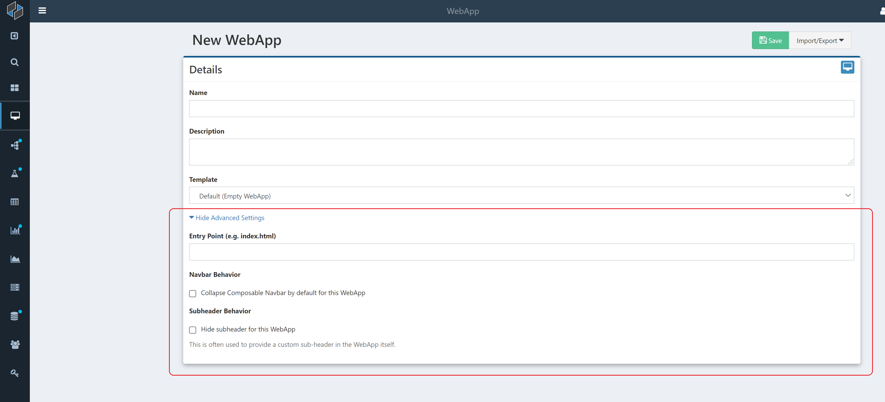

# Creating a New WebApp

To create a new WebApp, simply click on the WebApp icon, or Create New link, in the side navigation bar.

You will be presented with a simple configuration screen for the new WebApp.

Here, simply provide:

* Name: The name for the new WebApp
* Description: (optional) free form text that describes the WebApp
* Template: A blank or pre-configured template (html, css, js) for the WebApp

You are also able to set some additional "Advanced Settings" here:

* Entry Point: If you want to direct entry to the WebApp at a specific page (e.g. index.html)
* Navbar Behavior: Select this to automatically collapse (hide) the Composable side and top navigation bars
* Subheader Behavior: Select this to hide any custom sub-headers that may be set on the Composable instance.

Once saved, the WebApp is immediately created and you are presented with an overview screen.

On this screen, you can update any previous settings (e.g., Name, Description, Advanced Settings), and place the WebApp in a Folder or label it with Tags. As with other securable resources (DataFlows, QueryViews, etc.), a Share button is available that allows you to assign permissions for this WebApp to other Users and Groups.

You will also find two buttons in the top right for:
* Open WebApp: This will open up the WebApp in its own tab
* Edit Source: This will open up a web-based editor to edit your WebApps source code files (e.g., html, css, js, etc.)

# Editing a WebApp

Composable provides a full web-based development environment for creating and editing a WebApp.

The WebApp Code Editor is a high performance editor. It features:
* Syntax highlighting for various languages
* Search and replace (Ctrl-F)
* Live syntax checker
* Basic editor features, such as cut, copy, and paste functionality
* Multi-file editing

The left side of the WebApp Code Editor provides a tree-view of the Webapp Files. You can create folders, and create, move or import files by using the buttons provided.

You can select one or more files and open them up in the center of the screen for editing.

Once ready, you can simply press the green Save button, and then click View WebApp to open your WebApp.